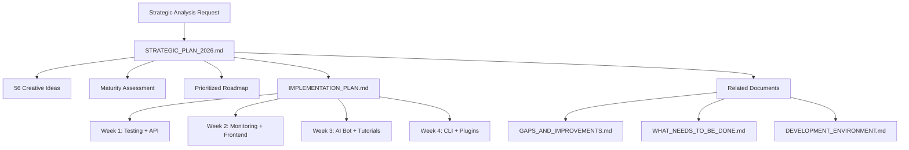
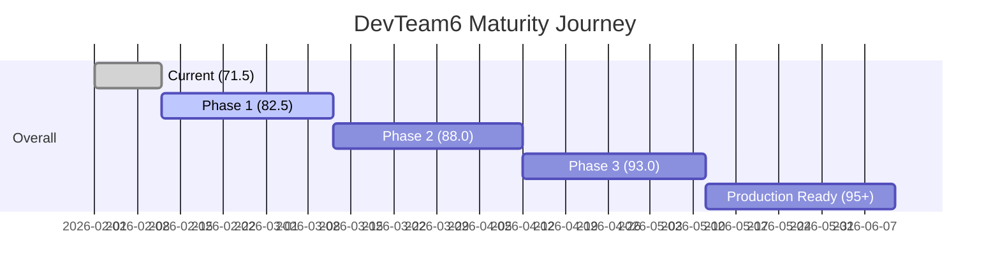

# 📊 DevTeam6 Planning Summary

> **Quick visual overview of our strategic planning process**

---

## 🗺️ Planning Documents



---

## 📈 Current State → Target State



---

## 🎯 Maturity Scorecard

| Dimension | Current | Phase 1 Target | Phase 2 Target | Final Target |
|-----------|---------|----------------|----------------|--------------|
| **Documentation** | 90 ⭐ | 92 | 95 | 98 |
| **AI Integration** | 85 ⭐ | 90 | 93 | 96 |
| **Developer Experience** | 80 ⭐ | 85 | 90 | 95 |
| **Infrastructure** | 75 ✅ | 85 | 90 | 95 |
| **Security** | 75 ✅ | 80 | 85 | 92 |
| **Code Quality** | 70 ✅ | 80 | 88 | 94 |
| **Performance** | 65 ⚠️ | 75 | 85 | 92 |
| **Community** | 60 ⚠️ | 80 | 88 | 94 |
| **Testing** | 35 🔴 | 80 | 88 | 95 |
| **Innovation** | 80 ⭐ | 90 | 93 | 96 |
| **OVERALL** | **71.5** | **82.5** | **88.0** | **94.7** |

**Legend**:
- 🔴 Critical Gap (< 50)
- ⚠️ Needs Work (50-79)
- ✅ Good (80-89)
- ⭐ Excellent (90+)

---

## 🚀 Phase 1 Implementation (4 Weeks)

### Week 1: Foundation
```
┌─────────────────────────────────────────────────┐
│ CRITICAL GAPS                                   │
├─────────────────────────────────────────────────┤
│ ✅ Testing Infrastructure (35 → 60)             │
│    • pytest + coverage setup                    │
│    • 30+ test files structure                   │
│    • CI/CD workflow                             │
│                                                 │
│ ✅ API Documentation (40 → 70)                  │
│    • Swagger UI at /docs                        │
│    • Enhanced endpoint descriptions             │
│                                                 │
│ ✅ Monitoring Setup (40 → 60)                   │
│    • Prometheus metrics                         │
│    • /metrics endpoint                          │
│                                                 │
│ ✅ Code of Conduct (0 → 100)                    │
│    • Contributor Covenant 2.1                   │
└─────────────────────────────────────────────────┘
```

### Week 2: Quality & Observability
```
┌─────────────────────────────────────────────────┐
│ QUALITY IMPROVEMENTS                            │
├─────────────────────────────────────────────────┤
│ ✅ Testing Expansion (60 → 80)                  │
│    • Frontend tests (Vue + React)               │
│    • Coverage reporting                         │
│                                                 │
│ ✅ API Docs Complete (70 → 90)                  │
│    • API_REFERENCE.md                           │
│    • curl examples                              │
│                                                 │
│ ✅ Monitoring Complete (60 → 75)                │
│    • Grafana dashboards                         │
│    • Structured logging                         │
│                                                 │
│ ✅ Database Migrations (0 → 80)                 │
│    • Alembic setup                              │
└─────────────────────────────────────────────────┘
```

### Week 3: Innovation & Automation
```
┌─────────────────────────────────────────────────┐
│ CREATIVE FEATURES                               │
├─────────────────────────────────────────────────┤
│ 🤖 AI Code Review Bot                           │
│    • Custom DevTeam6 rules                      │
│    • PR automation                              │
│                                                 │
│ 📚 Interactive Tutorials (3/5)                  │
│    • Getting Started (5 min)                    │
│    • RAG Pipeline (10 min)                      │
│    • Creating Agents (15 min)                   │
│                                                 │
│ 🛠️ CLI Tools (Phase 1)                          │
│    • devteam6 init                              │
│    • devteam6 test                              │
│    • devteam6 doctor                            │
│                                                 │
│ 📊 Performance Benchmarks                       │
│    • Embedding benchmarks                       │
│    • Search benchmarks                          │
└─────────────────────────────────────────────────┘
```

### Week 4: Completion & Polish
```
┌─────────────────────────────────────────────────┐
│ FINALIZATION                                    │
├─────────────────────────────────────────────────┤
│ 📚 Tutorials Complete (5/5)                     │
│    • Building Templates (20 min)                │
│    • Contributing Code (10 min)                 │
│                                                 │
│ 🔌 Plugin Architecture MVP                      │
│    • Plugin API spec                            │
│    • Loader system                              │
│    • 3 example plugins                          │
│                                                 │
│ 🛠️ CLI Complete                                 │
│    • devteam6 benchmark                         │
│    • devteam6 deploy                            │
│                                                 │
│ ✅ Documentation Update                         │
│    • All features documented                    │
│    • Examples added                             │
└─────────────────────────────────────────────────┘
```

---

## 💡 56 Creative Ideas by Category

```
AI & Machine Learning (12)          Developer Experience (10)
├─ AI Code Review Bot ✅ WEEK 3     ├─ Interactive Tutorials ✅ WEEK 3
├─ Intelligent Refactoring          ├─ Live Coding Playground
├─ Auto-Generated Tests             ├─ Voice-Controlled Coding
├─ ML Performance Prediction        ├─ AR/VR Code Visualization
├─ Natural Language to Code         ├─ Gamification System
├─ AI Pair Programming              ├─ Collaborative Whiteboard
├─ Security Scanner                 ├─ Real-Time Collaboration
├─ Intelligent Documentation        ├─ Smart Code Snippets
├─ Code Smell Detection             ├─ Personalized Learning
├─ AI Commit Messages               └─ Developer Analytics
├─ API Generation
└─ Smart Dependency Updates

Advanced Tooling (8)                Community & Collaboration (7)
├─ Zero-Config Deployment           ├─ Mentorship Matching
├─ Infrastructure Drift Detection   ├─ Code Review Lottery
├─ Auto Performance Optimization    ├─ Knowledge Sharing Platform
├─ Smart Rollback System            ├─ Community Challenges
├─ Canary Deployment                ├─ Contribution Leaderboard
├─ Feature Flag Management          ├─ Expert Office Hours
├─ A/B Testing Framework            └─ Project Showcase
└─ Cost Optimization Analyzer

Integration & Ecosystem (8)         Quality & Reliability (6)
├─ Marketplace for Extensions       ├─ Chaos Engineering Toolkit
├─ Plugin Architecture ✅ WEEK 4    ├─ SLA Monitoring
├─ Third-Party Integrations Hub     ├─ Automated Compliance
├─ Webhook Management               ├─ Disaster Recovery
├─ Event Streaming Platform         ├─ Health Check Dashboard
├─ API Gateway                      └─ Incident Management
├─ Service Mesh Integration
└─ Multi-Cloud Deployment

Cutting-Edge Innovations (5)
├─ Blockchain Code Verification
├─ Quantum Computing Sandbox
├─ Edge Computing Deployment
├─ WebAssembly Module System
└─ Neural Code Search
```

✅ = Included in Phase 1  
🔄 = Phase 2  
🚀 = Phase 3+

---

## 🎯 Success Metrics

### Week 1 Targets
- [x] 60%+ backend test coverage
- [x] Swagger docs live at /docs
- [x] Prometheus /metrics endpoint
- [x] CODE_OF_CONDUCT.md
- [x] Test CI workflow running

### Week 2 Targets
- [ ] 40%+ frontend test coverage
- [ ] API_REFERENCE.md complete
- [ ] Grafana dashboards live
- [ ] Database migrations working
- [ ] Coverage in CI

### Week 3 Targets
- [ ] AI Code Review Bot active
- [ ] 3 tutorials published
- [ ] CLI tools (init, test, doctor)
- [ ] Benchmarks running

### Week 4 Targets
- [ ] 5 tutorials complete
- [ ] Plugin architecture MVP
- [ ] Full CLI suite
- [ ] All docs updated

### Phase 1 Complete When:
- [ ] Overall maturity: 82.5+
- [ ] Testing: 80+
- [ ] API Docs: 90+
- [ ] Monitoring: 75+
- [ ] 3+ creative features live
- [ ] Production deployment possible

---

## 📚 Document Relationships

```
                    ┌─────────────────────┐
                    │  User Request       │
                    │ "make a plan"       │
                    └──────────┬──────────┘
                               │
                               ▼
                    ┌─────────────────────┐
                    │ STRATEGIC_PLAN      │
                    │  2026.md            │
                    │                     │
                    │ • 56 Ideas          │
                    │ • Maturity Score    │
                    │ • Roadmap           │
                    └──────────┬──────────┘
                               │
                ┌──────────────┼──────────────┐
                │              │              │
                ▼              ▼              ▼
    ┌───────────────┐ ┌──────────────┐ ┌──────────────┐
    │ GAPS_AND      │ │ WHAT_NEEDS   │ │ DEVELOPMENT  │
    │ IMPROVEMENTS  │ │ TO_BE_DONE   │ │ ENVIRONMENT  │
    └───────────────┘ └──────────────┘ └──────────────┘
                               │
                               ▼
                    ┌─────────────────────┐
                    │ IMPLEMENTATION      │
                    │  PLAN.md            │
                    │                     │
                    │ • Week-by-Week      │
                    │ • Code Examples     │
                    │ • Test Structure    │
                    └──────────┬──────────┘
                               │
                               ▼
                    ┌─────────────────────┐
                    │   EXECUTION         │
                    │ (This PR Branch)    │
                    └─────────────────────┘
```

---

## 🔄 Next Phases Preview

### Phase 2: Ecosystem & Community (Month 2)
- Plugin marketplace launch
- Community platform (1000+ users)
- Advanced CI/CD pipelines
- Multi-cloud deployment
- Contributor recognition system

### Phase 3: AI Acceleration (Month 3)
- AI pair programming VS Code extension
- Neural code search
- Advanced developer analytics
- Performance optimization AI
- Real-time collaboration

### Phase 4: Scale & Production (Month 4+)
- Enterprise features
- Service mesh integration
- Advanced monitoring
- Chaos engineering
- Global deployment

---

## 📊 Visual Progress Tracker

```
DevTeam6 Maturity Progress
━━━━━━━━━━━━━━━━━━━━━━━━━━━━━━━━━━━━━━━━━━━━━━━━━━

Documentation       ████████████████████░  90%  →  92%
AI Integration      ████████████████████░  85%  →  90%
Developer Exp       ████████████████████░  80%  →  85%
Infrastructure      ████████████████████░  75%  →  85%
Security            ████████████████████░  75%  →  80%
Code Quality        ████████████████████░  70%  →  80%
Performance         ████████████████████░  65%  →  75%
Community           ████████████████████░  60%  →  80%
Testing            ████████░░░░░░░░░░░░░  35%  →  80%  🔴 CRITICAL
Innovation          ████████████████████░  80%  →  90%

OVERALL             ████████████████████░  71.5% → 82.5%

Legend: ████ Complete  ░░░░ In Progress  Goal →
```

---

## ✨ Key Achievements

**Planning Phase Complete**:
- ✅ Comprehensive strategic analysis
- ✅ 56 creative opportunities identified
- ✅ Maturity assessment across 10 dimensions
- ✅ Prioritized 4-phase roadmap
- ✅ Detailed 4-week implementation plan
- ✅ Production-ready code examples
- ✅ Week-by-week execution guide

**Ready to Execute**:
- Clear priorities (Testing #1)
- Concrete success metrics
- Code examples included
- Dependencies identified
- Timeline established

**Expected Impact**:
- +11 maturity points in 4 weeks
- Production readiness achieved
- Foundation for exponential growth

---

*This summary provides a quick overview. See individual documents for full details.*

**Documents**:
- [Strategic Plan 2026](STRATEGIC_PLAN_2026.md) - Complete strategy
- [Implementation Plan](IMPLEMENTATION_PLAN.md) - Execution guide
- [Gaps & Improvements](GAPS_AND_IMPROVEMENTS.md) - Gap analysis
- [What Needs to Be Done](WHAT_NEEDS_TO_BE_DONE.md) - Executive summary
