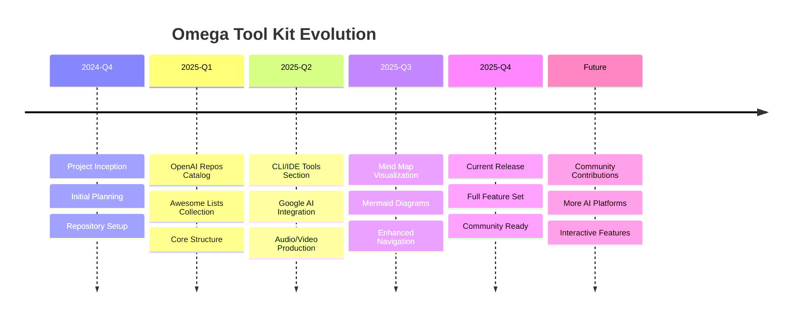
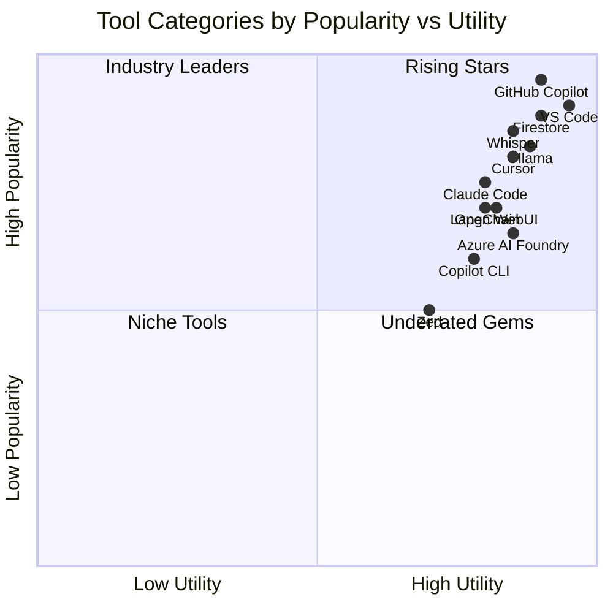

# 🌀 DevTeam6 - The Omega Tool Kit 🚀

<div align="center">

> **🔮 The Ultimate AI Developer Workspace Toolkit for VS Code 🔮**
> 
> *An Awesome List of All Awesome Lists - 10x Curated for AI Development*

[](LICENSE)
[](https://awesome.re)
[](https://github.com/SpiralCloudOmega/DevTeam6)
[](https://github.com/SpiralCloudOmega/DevTeam6/fork)
[](https://github.com/SpiralCloudOmega/DevTeam6/commits)
[](https://github.com/SpiralCloudOmega/DevTeam6/pulls)

</div>

---

## 🎨 Omega Tool Kit - System Architecture

> **🔮 Build Process Flow: From Foundation to Production**

```mermaid
%%{init: {'theme': 'dark', 'themeVariables': { 'primaryColor': '#0ff', 'primaryTextColor': '#fff', 'primaryBorderColor': '#0ff', 'lineColor': '#f0f', 'secondaryColor': '#1a1a2e', 'tertiaryColor': '#16213e', 'background': '#0d1117', 'mainBkg': '#1a1a2e', 'nodeBorder': '#0ff', 'clusterBkg': '#16213e', 'clusterBorder': '#f0f', 'titleColor': '#0ff', 'edgeLabelBackground':'#1a1a2e'}}}%%
flowchart TB
    subgraph LAYER1["🏗️ PHASE 1: FOUNDATION"]
        direction LR
        A1[/"📦 Package Managers<br/>npm • pip • cargo"/]
        A2[/"🔧 Build Tools<br/>Vite • Webpack • esbuild"/]
        A3[/"📋 Version Control<br/>Git • GitHub CLI • Copilot CLI"/]
    end
    
    subgraph LAYER2["🤖 PHASE 2: AI CORE"]
        direction LR
        B1[/"🧠 OpenAI<br/>GPT • Whisper • DALL-E"/]
        B2[/"🔵 Google AI<br/>Gemini • Vertex AI • Genkit"/]
        B3[/"🟠 Anthropic<br/>Claude • Claude Code"/]
        B4[/"🔷 Microsoft<br/>Azure AI Foundry • Copilot"/]
    end
    
    subgraph LAYER3["🖥️ PHASE 3: DEVELOPMENT"]
        direction LR
        C1[/"💻 IDEs<br/>Cursor • VS Code • Zed • Void"/]
        C2[/"🛠️ CLI Tools<br/>Warp • Copilot CLI • Fig"/]
        C3[/"🔌 Extensions<br/>Copilot • Codeium • Continue"/]
    end
    
    subgraph LAYER4["🦙 PHASE 4: LOCAL AI"]
        direction LR
        L1[/"🏠 Ollama<br/>Run LLMs Locally"/]
        L2[/"🌐 Open WebUI<br/>Chat Interface"/]
        L3[/"📦 Models<br/>Llama • Mistral • Phi"/]
    end
    
    subgraph LAYER5["🔥 PHASE 5: FIREBASE & CLOUD"]
        direction LR
        F1[/"📊 Firestore<br/>NoSQL Database"/]
        F2[/"☁️ Cloud Functions<br/>Serverless Backend"/]
        F3[/"🔐 Auth & Hosting<br/>Firebase Services"/]
    end
    
    subgraph LAYER6["🚀 PHASE 6: PRODUCTION"]
        direction LR
        P1[/"☁️ Cloud Deploy<br/>AWS • GCP • Azure"/]
        P2[/"🐳 Containers<br/>Docker • Kubernetes"/]
        P3[/"📊 Monitoring<br/>Grafana • Prometheus"/]
    end
    
    LAYER1 --> LAYER2
    LAYER2 --> LAYER3
    LAYER3 --> LAYER4
    LAYER4 --> LAYER5
    LAYER5 --> LAYER6
    
    style LAYER1 fill:#0d1117,stroke:#00ffff,stroke-width:3px,color:#00ffff
    style LAYER2 fill:#0d1117,stroke:#ff00ff,stroke-width:3px,color:#ff00ff
    style LAYER3 fill:#0d1117,stroke:#00ff00,stroke-width:3px,color:#00ff00
    style LAYER4 fill:#0d1117,stroke:#ffaa00,stroke-width:3px,color:#ffaa00
    style LAYER5 fill:#0d1117,stroke:#FFCA28,stroke-width:3px,color:#FFCA28
    style LAYER6 fill:#0d1117,stroke:#00ffff,stroke-width:3px,color:#00ffff
```



---

## 🔮 Mind Map - The Complete Ecosystem

```mermaid
%%{init: {'theme': 'dark', 'themeVariables': { 'primaryColor': '#ff00ff', 'primaryTextColor': '#ffffff', 'primaryBorderColor': '#00ffff', 'lineColor': '#00ffff', 'secondaryColor': '#1a1a2e', 'tertiaryColor': '#16213e'}}}%%
mindmap
  root((🌀 OMEGA<br/>TOOL KIT))
    🤖 AI PLATFORMS
      🧠 OpenAI
        GPT-4/GPT-5
        Whisper
        DALL-E 3
        Codex CLI
        Agents SDK
        Swarm
      🔵 Google AI
        Gemini 2.0
        Gemini CLI
        Vertex AI
        AI Studio
        Project IDX
        Firebase Genkit
        TensorFlow
        JAX/Flax
      🟠 Anthropic
        Claude 3.5
        Claude Code
        Claude Skills
        MCP SDK
      🔷 Microsoft
        Azure AI Foundry
        GitHub Copilot
        Copilot CLI
        Azure OpenAI
        Phi Models
      ⚛️ Quantum AI
        Qiskit
        Cirq
        PennyLane
        Q#
    🖥️ DEV TOOLS
      💻 IDEs
        Cursor
        VS Code
        Zed
        Windsurf
        Void
        Neovim
      🛠️ CLI
        GitHub CLI
        Copilot CLI
        Warp
        Fig
        Ollama
        LM Studio
      🔌 Extensions
        Copilot
        Codeium
        Tabnine
        Continue
    🦙 LOCAL AI
      🏠 Self-Hosted
        Ollama
        Open WebUI
        LocalAI
        GPT4All
        Jan
        AnythingLLM
      📦 Models
        Llama 3
        Mistral
        CodeLlama
        Phi
        Gemma
    🔥 FIREBASE
      📊 Databases
        Firestore
        Realtime DB
      🔐 Auth
        Firebase Auth
        Identity Platform
      ☁️ Backend
        Cloud Functions
        Hosting
        Extensions
      🤖 AI
        Genkit
        Vertex AI
    🎨 CREATIVE
      🎵 Audio
        Whisper
        Bark
        Coqui TTS
        Audacity
        LMMS
      🎬 Video
        FFmpeg
        OBS
        Kdenlive
        DaVinci
      🖼️ Image
        Stable Diffusion
        ComfyUI
        Fooocus
        Midjourney
    📚 LEARNING
      ⭐ Awesome
        300+ Lists
        Curated
      📋 Cheatsheets
        Git
        Docker
        K8s
      🔬 Research
        AlphaXiv
        arXiv
        Papers
    ☁️ DEPLOY
      🐳 Containers
        Docker
        Kubernetes
        Podman
      🌐 Cloud
        AWS
        GCP
        Azure
      📊 Monitor
        Grafana
        Prometheus
```



---

## 🏗️ Architecture Overview

```mermaid
%%{init: {'theme': 'dark', 'themeVariables': { 'primaryColor': '#00ffff', 'primaryTextColor': '#fff', 'primaryBorderColor': '#ff00ff', 'lineColor': '#00ffff', 'secondaryColor': '#1a1a2e', 'tertiaryColor': '#16213e', 'clusterBkg': '#0d1117', 'clusterBorder': '#00ffff'}}}%%
graph TB
    subgraph "🌀 OMEGA TOOL KIT"
        direction TB
        
        subgraph "🎬 Content & Updates"
            YT[📺 YouTube Channels]
            CONF[🎪 Conferences]
            NEWS[📰 Changelogs]
        end
        
        subgraph "🤖 AI Development"
            OPENAI[🧠 OpenAI Repos]
            GOOGLE[🔵 Google AI]
            CLAUDE[🟠 Claude/Anthropic]
            AGENTS[🤖 AI Agents]
            QUANTUM[⚛️ Quantum Computing]
        end
        
        subgraph "🖥️ Development Tools"
            IDE[💻 IDEs & Editors]
            CLI[🛠️ CLI Tools]
            EXT[🔌 VS Code Extensions]
        end
        
        subgraph "🎨 Creative Tools"
            AUDIO[🎵 Audio Production]
            VIDEO[🎬 Video Editing]
            STREAM[📡 Streaming]
        end
        
        subgraph "📚 Resources"
            AWESOME[⭐ Awesome Lists]
            CHEAT[📋 Cheatsheets]
            DOCS[📖 Documentation]
            RESEARCH[🔬 Research Papers]
        end
    end
    
    YT --> OPENAI
    CONF --> GOOGLE
    OPENAI --> IDE
    GOOGLE --> CLI
    CLAUDE --> EXT
    AGENTS --> AUDIO
    QUANTUM --> RESEARCH
    IDE --> AWESOME
    CLI --> CHEAT
    AUDIO --> STREAM
    VIDEO --> STREAM
    
    style OPENAI fill:#10a37f,stroke:#00ffff,stroke-width:2px,color:#fff
    style GOOGLE fill:#4285f4,stroke:#00ffff,stroke-width:2px,color:#fff
    style CLAUDE fill:#d97706,stroke:#00ffff,stroke-width:2px,color:#fff
    style QUANTUM fill:#9945ff,stroke:#ff00ff,stroke-width:2px,color:#fff
    style IDE fill:#007acc,stroke:#00ffff,stroke-width:2px,color:#fff
    style AUDIO fill:#1db954,stroke:#00ffff,stroke-width:2px,color:#fff
    style VIDEO fill:#ff0000,stroke:#00ffff,stroke-width:2px,color:#fff
    style RESEARCH fill:#ff00ff,stroke:#00ffff,stroke-width:2px,color:#fff
```



---

## 📊 Repository Stats

<div align="center">

| 📦 Category | 🔢 Count | 📝 Description |
|:------------|:--------:|:---------------|
| 🌐 **Total Resources** | `1,000+` | Curated tools, libraries & repos |
| 🤖 **AI/ML Resources** | `500+` | AI platforms, models & tools |
| 🛠️ **Developer Tools** | `300+` | IDEs, CLIs, extensions |
| ⭐ **Awesome Lists** | `300+` | Curated awesome collections |
| ⚛️ **Quantum Computing** | `50+` | Quantum frameworks & tools |
| 🎨 **Creative Tools** | `100+` | Audio, video, design tools |
| 📋 **Cheatsheets** | `50+` | Quick reference guides |
| 🎓 **Learning Resources** | `150+` | Courses, books, tutorials |

</div>

---

## 🔗 Quick Navigation

```mermaid
%%{init: {'theme': 'dark', 'themeVariables': { 'primaryColor': '#00ffff', 'primaryTextColor': '#fff', 'primaryBorderColor': '#ff00ff', 'lineColor': '#ff00ff', 'secondaryColor': '#1a1a2e'}}}%%
graph LR
    A[🏠 Start] --> B{What do you need?}
    B --> C[🤖 AI Development]
    B --> D[🖥️ IDE/CLI Tools]
    B --> E[🦙 Local AI]
    B --> F[🔥 Firebase/Cloud]
    B --> G[📚 Learning]
    
    C --> C1[OpenAI Repos]
    C --> C2[Google AI]
    C --> C3[AI Agents]
    
    D --> D1[Cursor/VS Code]
    D --> D2[Copilot CLI]
    D --> D3[Extensions]
    
    E --> E1[Ollama]
    E --> E2[Open WebUI]
    E --> E3[LM Studio]
    
    F --> F1[Firestore]
    F --> F2[Vertex AI]
    F --> F3[Azure AI Foundry]
    
    G --> G1[Awesome Lists]
    G --> G2[Cheatsheets]
    G --> G3[Tutorials]
    
    style A fill:#10a37f,stroke:#00ffff,stroke-width:2px,color:#fff
    style B fill:#6366f1,stroke:#ff00ff,stroke-width:2px,color:#fff
    style C fill:#10a37f,stroke:#00ffff,stroke-width:2px,color:#fff
    style D fill:#007acc,stroke:#00ffff,stroke-width:2px,color:#fff
    style E fill:#000000,stroke:#00ffff,stroke-width:2px,color:#fff
    style F fill:#FFCA28,stroke:#00ffff,stroke-width:2px,color:#000
    style G fill:#f59e0b,stroke:#00ffff,stroke-width:2px,color:#fff
```



---

## 🎬 GitHub News & Developer Updates

<div align="center">

### 📺 Latest GitHub Universe & Developer Conferences

| Event | Description | Watch |
|-------|-------------|-------|
| **GitHub Universe 2025** | The latest global developer event | [](https://www.youtube.com/@GitHub) |
| **GitHub Universe 2024** | AI-powered developer experience | [](https://www.youtube.com/playlist?list=PL0lo9MOBetEFmtstItnKlhJJVmMghxc0P) |
| **GitHub Universe 2023** | The future of software development | [](https://www.youtube.com/playlist?list=PL0lo9MOBetEEK4j-gRy2svO-f-FJKwCeS) |
| **GitHub Changelog** | Weekly product updates | [](https://www.youtube.com/playlist?list=PL0lo9MOBetEGNm57nZQXnNo_VSA_8tUbI) |
| **GitHub Copilot Demos** | AI coding assistant tutorials | [](https://www.youtube.com/playlist?list=PL0lo9MOBetEGvsbgB8eRxKD2Qy0A_gsVy) |
| **GitHub Actions** | CI/CD automation tutorials | [](https://www.youtube.com/playlist?list=PL0lo9MOBetEHxJgZXDqULenQ2VlY7sJ_F) |

### 🔴 Live Channels & Continuous Updates

| Channel | Content | Link |
|---------|---------|------|
| **GitHub** | Official GitHub channel | [](https://www.youtube.com/@GitHub) |
| **GitHub Developer** | Technical deep dives | [](https://www.youtube.com/@GitHubDeveloper) |
| **OpenAI** | AI research & updates | [](https://www.youtube.com/@OpenAI) |
| **Google AI** | Google AI innovations | [](https://www.youtube.com/@GoogleAI) |
| **Anthropic** | Claude & AI safety | [](https://www.youtube.com/@AnthropicAI) |
| **Microsoft Developer** | Dev tools & Azure AI | [](https://www.youtube.com/@MicrosoftDeveloper) |

</div>

---

## 📑 Master Contents Index

> **The GitHub Master Encyclopedia** - A comprehensive index of everything that matters in AI development, open source, and developer tools. Navigate to any section below.

---

### 🎬 Media & Updates
- [GitHub News & Developer Updates](#-github-news--developer-updates)
  - [GitHub Universe Conferences](#-latest-github-universe--developer-conferences)
  - [Live YouTube Channels](#-live-channels--continuous-updates)
  - [Developer Podcasts](#-developer-podcasts)
  - [Tech News Sources](#-tech-news-sources)

### 🤖 Artificial Intelligence
- [OpenAI Official Repositories](#-openai-official-repositories)
  - [Featured Repos (90k+ ⭐)](#-featured--most-popular-90k-)
  - [Language Models & GPT](#-language-models--gpt)
  - [AI Agents & Multi-Agent Systems](#-ai-agents--multi-agent-systems)
  - [Generative AI & Vision](#-generative-ai--vision)
  - [Official SDKs & Libraries](#-official-sdks--libraries)
  - [Evaluation & Benchmarks](#-evaluation--benchmarks)
  - [Reinforcement Learning](#-reinforcement-learning)
  - [Plugins & Integrations](#-plugins--integrations)
  - [Realtime & Voice](#️-realtime--voice)
  - [Developer Tools & Demos](#️-developer-tools--demos)
  - [Research & Papers](#-research--papers)
  - [Safety & Guardrails](#-safety--guardrails)
  - [Apps & ChatKit](#-apps--chatkit)
  - [Infrastructure & Tools](#️-infrastructure--tools)
- [Awesome Google](#-awesome-google)
  - [Google AI & Gemini](#-google-ai--gemini)
  - [Google Developer Tools](#-google-developer-tools)
  - [Google AI Projects](#-google-ai-projects)
  - [Google Web & Mobile](#-google-web--mobile)
- [Anthropic & Claude](#-anthropic--claude)
  - [Claude Code](#-claude-code)
  - [Claude Skills](#-claude-skills)
  - [Claude API & SDKs](#-claude-api--sdks)
- [AI Development Frameworks](#-ai-development-frameworks)
  - [LLM Frameworks](#-llm-frameworks)
  - [AI Agent Frameworks](#-ai-agent-frameworks)
  - [Local LLM Tools](#️-local-llm-tools)
- [MCP Servers & AI Agents](#-mcp-servers--ai-agents)
  - [Model Context Protocol](#-model-context-protocol)
  - [Popular MCP Servers](#️-popular-mcp-servers)

### 🖥️ Development Tools
- [CLI/IDE Tools & AI Coding Assistants](#️-cliide-tools--ai-coding-assistants)
  - [Major Players - AI-Powered IDEs](#-the-major-players---ai-powered-ides--clis)
  - [Enterprise AI Platforms & Cloud Tools](#️-enterprise-ai-platforms--cloud-tools)
  - [Google Cloud & Firebase Ecosystem](#-google-cloud--firebase-ecosystem)
  - [Local AI & Self-Hosted Solutions](#-local-ai--self-hosted-solutions)
  - [AI Coding Assistants & Extensions](#-ai-coding-assistants--extensions)
  - [CLI Tools & Terminal Assistants](#️-cli-tools--terminal-assistants)
  - [Awesome AI Coding Resources](#-awesome-ai-coding-resources)
- [VS Code Extensions & Tools](#-vs-code-extensions--tools)
  - [AI-Powered Extensions](#-ai-powered-extensions)
  - [Productivity & UI](#-productivity--ui)
  - [Language Support](#-language-support)
  - [DevOps & Containers](#-devops--containers)
- [Text Editors & IDEs](#-text-editors--ides)
  - [Modern Editors](#-modern-editors)
  - [Classic Editors](#-classic-editors)
  - [Cloud IDEs](#-cloud-ides)
- [Terminal & Shell](#-terminal--shell)
  - [Terminal Emulators](#-terminal-emulators)
  - [Shell Frameworks](#-shell-frameworks)
  - [Command Line Tools](#-command-line-tools)

### 💻 Programming Languages
- [Awesome Python](#-awesome-python)
  - [Python Frameworks](#-python-frameworks)
  - [Python Libraries](#-python-libraries)
  - [Python Tools](#-python-tools)
- [Awesome JavaScript](#-awesome-javascript)
  - [JavaScript Frameworks](#-javascript-frameworks)
  - [Node.js Ecosystem](#-nodejs-ecosystem)
  - [TypeScript](#-typescript)
- [Awesome Go](#-awesome-go)
  - [Go Frameworks](#-go-frameworks)
  - [Go Tools](#-go-tools)
- [Awesome Rust](#-awesome-rust)
  - [Rust Frameworks](#-rust-frameworks)
  - [Rust Tools](#-rust-tools)
- [Awesome Java](#-awesome-java)
- [Awesome C/C++](#-awesome-cc)
- [Awesome Swift](#-awesome-swift)
- [Awesome Kotlin](#-awesome-kotlin)
- [Awesome Ruby](#-awesome-ruby)
- [Awesome PHP](#-awesome-php)
- [Awesome Elixir](#-awesome-elixir)
- [Awesome Scala](#-awesome-scala)
- [Awesome Haskell](#-awesome-haskell)
- [Awesome R](#-awesome-r)
- [Awesome Julia](#-awesome-julia)
- [Awesome Zig](#-awesome-zig)

### 🌐 Web Development
- [Frontend Frameworks](#-frontend-frameworks)
  - [React Ecosystem](#-react-ecosystem)
  - [Vue Ecosystem](#-vue-ecosystem)
  - [Angular Ecosystem](#-angular-ecosystem)
  - [Svelte Ecosystem](#-svelte-ecosystem)
  - [Solid.js](#-solidjs)
  - [Astro](#-astro)
  - [Qwik](#-qwik)
- [Backend Frameworks](#-backend-frameworks)
  - [Node.js Frameworks](#-nodejs-frameworks)
  - [Python Web Frameworks](#-python-web-frameworks)
  - [Go Web Frameworks](#-go-web-frameworks)
  - [Rust Web Frameworks](#-rust-web-frameworks)
- [Full-Stack Frameworks](#-full-stack-frameworks)
  - [Next.js](#-nextjs)
  - [Nuxt.js](#-nuxtjs)
  - [Remix](#-remix)
  - [SvelteKit](#-sveltekit)
- [CSS & Styling](#-css--styling)
  - [CSS Frameworks](#-css-frameworks)
  - [CSS-in-JS](#-css-in-js)
  - [UI Component Libraries](#-ui-component-libraries)
- [Build Tools](#-build-tools)
  - [Bundlers](#-bundlers)
  - [Task Runners](#-task-runners)
  - [Package Managers](#-package-managers)

### 📱 Mobile Development
- [Awesome iOS](#-awesome-ios)
  - [Swift Libraries](#-swift-libraries)
  - [iOS Tools](#-ios-tools)
- [Awesome Android](#-awesome-android)
  - [Kotlin Libraries](#-kotlin-libraries)
  - [Android Tools](#-android-tools)
- [Cross-Platform](#-cross-platform)
  - [React Native](#-react-native)
  - [Flutter](#-flutter)
  - [Expo](#-expo)
  - [Capacitor](#-capacitor)
  - [Tauri](#-tauri)

### ☁️ Cloud & DevOps
- [Cloud Platforms](#-cloud-platforms)
  - [AWS](#-aws)
  - [Google Cloud](#-google-cloud)
  - [Azure](#-azure)
  - [DigitalOcean](#-digitalocean)
  - [Vercel](#-vercel)
  - [Netlify](#-netlify)
  - [Cloudflare](#-cloudflare)
- [Infrastructure as Code](#-infrastructure-as-code)
  - [Terraform](#-terraform)
  - [Pulumi](#-pulumi)
  - [Ansible](#-ansible)
  - [Chef](#-chef)
  - [Puppet](#-puppet)
- [Containers & Orchestration](#-containers--orchestration)
  - [Docker](#-docker)
  - [Kubernetes](#-kubernetes)
  - [Helm](#-helm)
  - [Podman](#-podman)
- [CI/CD](#-cicd)
  - [GitHub Actions](#-github-actions)
  - [GitLab CI](#-gitlab-ci)
  - [Jenkins](#-jenkins)
  - [CircleCI](#-circleci)
  - [ArgoCD](#-argocd)
- [Monitoring & Observability](#-monitoring--observability)
  - [Prometheus](#-prometheus)
  - [Grafana](#-grafana)
  - [Datadog](#-datadog)
  - [OpenTelemetry](#-opentelemetry)

### 🗃️ Databases
- [SQL Databases](#-sql-databases)
  - [PostgreSQL](#-postgresql)
  - [MySQL](#-mysql)
  - [SQLite](#-sqlite)
- [NoSQL Databases](#-nosql-databases)
  - [MongoDB](#-mongodb)
  - [Redis](#-redis)
  - [Elasticsearch](#-elasticsearch)
- [Vector Databases](#-vector-databases)
  - [Pinecone](#-pinecone)
  - [Weaviate](#-weaviate)
  - [Milvus](#-milvus)
  - [Chroma](#-chroma)
- [Graph Databases](#-graph-databases)
  - [Neo4j](#-neo4j)
  - [ArangoDB](#-arangodb)
- [Database Tools](#-database-tools)
  - [ORMs](#-orms)
  - [Migration Tools](#-migration-tools)
  - [Admin Tools](#-admin-tools)

### 🔒 Security
- [Application Security](#-application-security)
  - [Authentication](#-authentication)
  - [Authorization](#-authorization)
  - [Encryption](#-encryption)
- [Network Security](#-network-security)
  - [Firewalls](#-firewalls)
  - [VPNs](#-vpns)
  - [Intrusion Detection](#-intrusion-detection)
- [Security Tools](#-security-tools)
  - [Penetration Testing](#-penetration-testing)
  - [Vulnerability Scanning](#-vulnerability-scanning)
  - [SIEM](#-siem)
- [Security Resources](#-security-resources)
  - [OWASP](#-owasp)
  - [Security Cheatsheets](#-security-cheatsheets)
  - [CTF Resources](#-ctf-resources)

### 🎨 Creative & Media
- [Awesome Audio/Video Production](#-awesome-audiovideo-production)
  - [Video Editing & Production](#-video-editing--production)
  - [Audio Production & DAWs](#-audio-production--daws)
  - [AI Audio & Voice](#-ai-audio--voice)
  - [AI Video Generation](#-ai-video-generation)
  - [Audio Libraries & Tools](#️-audio-libraries--tools)
  - [Streaming & Broadcasting](#-streaming--broadcasting)
- [Design Tools](#-design-tools)
  - [UI/UX Design](#-uiux-design)
  - [Graphic Design](#-graphic-design)
  - [3D & Animation](#-3d--animation)
  - [Icon Libraries](#-icon-libraries)
- [Image Processing](#-image-processing)
  - [Image Editors](#-image-editors)
  - [Image Libraries](#-image-libraries)
  - [AI Image Tools](#-ai-image-tools)

### 🎮 Game Development
- [Game Engines](#-game-engines)
  - [Unity](#-unity)
  - [Unreal Engine](#-unreal-engine)
  - [Godot](#-godot)
  - [Bevy](#-bevy)
- [Game Libraries](#-game-libraries)
  - [Graphics Libraries](#-graphics-libraries)
  - [Physics Engines](#-physics-engines)
  - [Audio Libraries](#-audio-libraries)
- [Game Tools](#-game-tools)
  - [Asset Creation](#-asset-creation)
  - [Level Design](#-level-design)
  - [Game Analytics](#-game-analytics)

### 📊 Data Science & ML
- [Machine Learning](#-machine-learning)
  - [ML Frameworks](#-ml-frameworks)
  - [Deep Learning](#-deep-learning)
  - [AutoML](#-automl)
- [Data Processing](#-data-processing)
  - [Data Pipelines](#-data-pipelines)
  - [ETL Tools](#-etl-tools)
  - [Data Validation](#-data-validation)
- [Data Visualization](#-data-visualization)
  - [Charting Libraries](#-charting-libraries)
  - [Dashboard Tools](#-dashboard-tools)
  - [BI Tools](#-bi-tools)
- [MLOps](#-mlops)
  - [Model Training](#-model-training)
  - [Model Serving](#-model-serving)
  - [Experiment Tracking](#-experiment-tracking)

### ⚛️ Quantum Computing
- [Quantum Frameworks](#-quantum-frameworks)
  - [Qiskit (IBM)](#-qiskit-ibm)
  - [Cirq (Google)](#-cirq-google)
  - [PennyLane](#-pennylane)
  - [Q# (Microsoft)](#-q-microsoft)
- [Quantum Hardware](#-quantum-hardware)
  - [IBM Quantum](#-ibm-quantum)
  - [Google Quantum AI](#-google-quantum-ai)
  - [Amazon Braket](#-amazon-braket)
- [Quantum Resources](#-quantum-resources)
  - [Quantum ML](#-quantum-ml)
  - [Quantum Algorithms](#-quantum-algorithms)
  - [Quantum Learning](#-quantum-learning)

### 🔗 Blockchain & Web3
- [Blockchain Platforms](#-blockchain-platforms)
  - [Ethereum](#-ethereum)
  - [Solana](#-solana)
  - [Polygon](#-polygon)
- [Smart Contracts](#-smart-contracts)
  - [Solidity](#-solidity)
  - [Rust Contracts](#-rust-contracts)
- [Web3 Tools](#-web3-tools)
  - [Wallets](#-wallets)
  - [DeFi](#-defi)
  - [NFT Tools](#-nft-tools)

### 📚 Learning & Resources
- [Awesome Lists of Awesome Lists](#-awesome-lists-of-awesome-lists)
  - [Meta Awesome Lists](#-the-ultimate-meta-awesome-lists)
  - [Programming Languages](#-programming-languages)
  - [AI & Machine Learning](#-ai--machine-learning)
  - [Web Development](#-web-development)
  - [DevOps & Infrastructure](#-devops--infrastructure)
  - [Security](#-security-1)
  - [Mobile & Desktop](#-mobile--desktop)
  - [Learning & Career](#-learning--career)
  - [Design & Creative](#-design--creative)
  - [Tools & Utilities](#-tools--utilities)
  - [Data & Databases](#-data--databases)
  - [Other Awesome Lists](#-other-awesome-lists)
- [GitHub Cheatsheets](#-github-cheatsheets)
  - [Git & GitHub Cheatsheets](#-essential-git--github-cheatsheets)
  - [Security Cheatsheets](#️-security-cheatsheets)
  - [Development Cheatsheets](#-development-cheatsheets)
- [Books & Courses](#-books--courses)
  - [Free Programming Books](#-free-programming-books)
  - [Online Courses](#-online-courses)
  - [Interactive Learning](#-interactive-learning)
- [Interview Prep](#-interview-prep)
  - [Coding Interview](#-coding-interview)
  - [System Design](#-system-design)
  - [Behavioral Interview](#-behavioral-interview)

### 🔬 Research & Papers
- [AI Research Platforms](#-ai-research-platforms)
  - [AlphaXiv](#-alphaxiv)
  - [arXiv](#-arxiv)
  - [Semantic Scholar](#-semantic-scholar)
  - [Papers With Code](#-papers-with-code)
  - [Google Scholar](#-google-scholar)
- [Research Tools](#-research-tools)
  - [Citation Managers](#-citation-managers)
  - [Research Writing](#-research-writing)

### 🧪 Interactive Development
- [Notebooks & Playgrounds](#-notebooks--playgrounds)
  - [Google Colab](#-google-colab)
  - [Jupyter Notebooks](#-jupyter-notebooks)
  - [Observable](#-observable)
  - [Kaggle Notebooks](#-kaggle-notebooks)
- [CLI Playgrounds](#-cli-playgrounds)
  - [GitHub CLI](#-github-cli-playground)
  - [Terminal Emulators](#-online-terminal-emulators)
- [AI Playgrounds](#-ai-playgrounds)
  - [OpenAI Playground](#-openai-playground)
  - [Google AI Studio](#-google-ai-studio)
  - [Anthropic Console](#-anthropic-console)
- [Git Visualization](#-git-visualization)
  - [GitKraken](#-gitkraken)
  - [Git Graph Tools](#-git-graph-tools)

### 🚀 Getting Started
- [Quick Start Guides](#-quick-start-guides)
  - [Getting Started with OpenAI](#getting-started-with-openai)
  - [Setting Up Codex CLI](#setting-up-codex-cli)
  - [Running Local LLMs with Ollama](#running-local-llms-with-ollama)
  - [VS Code Workspace Setup](#vs-code-workspace-setup)
- [Resources & Documentation](#-resources--documentation)
  - [Official Documentation](#-official-documentation)
  - [Learning Resources](#-learning-resources)
  - [Stay Updated](#-stay-updated)
- [Technology Ecosystem](#-technology-ecosystem)
- [Project Timeline](#-project-timeline)
- [Feature Matrix](#-feature-matrix)
- [Contributing](#-contributing)
- [Acknowledgments](#-acknowledgments)
- [License](#-license)

---

## 📊 Repository Statistics

<div align="center">

| Category | Count | Description |
|----------|-------|-------------|
| 📦 **Total Resources** | 1,000+ | Curated tools, libraries & repos |
| 🤖 **AI/ML Resources** | 500+ | AI platforms, models & tools |
| 🛠️ **Developer Tools** | 300+ | IDEs, CLIs, extensions |
| 📚 **Awesome Lists** | 200+ | Curated awesome collections |
| 🎨 **Creative Tools** | 100+ | Audio, video, design tools |
| 📋 **Cheatsheets** | 50+ | Quick reference guides |
| 🎓 **Learning Resources** | 150+ | Courses, books, tutorials |

</div>

---

## 🖥️ CLI/IDE Tools & AI Coding Assistants

### 🔥 The Major Players - AI-Powered IDEs & CLIs

<div align="center">

[](https://cursor.com/)
[](https://github.com/features/copilot)
[](https://www.anthropic.com/claude-code)
[](https://github.com/google-gemini/gemini-cli)

</div>

| Tool | Description | Link | Stars |
|------|-------------|------|-------|
| **Cursor** | The AI-first code editor built on VS Code | [cursor.com](https://cursor.com/) | 🔥 Hot |
| **Claude Code** | Anthropic's agentic coding tool | [anthropic.com](https://www.anthropic.com/claude-code) | 🔥 Hot |
| **GitHub Copilot** | AI pair programmer by GitHub/OpenAI | [github.com/features/copilot](https://github.com/features/copilot) | 🔥 Hot |
| **GitHub Copilot CLI** | AI in your terminal for shell commands | [github.com/github/gh-copilot](https://github.com/github/gh-copilot) | 🔥 Hot |
| **OpenAI Codex CLI** | Lightweight coding agent in terminal | [openai/codex](https://github.com/openai/codex) | 51k+ |
| **Google Gemini CLI** | Google's AI in your terminal | [google-gemini/gemini-cli](https://github.com/google-gemini/gemini-cli) | 🔥 New |
| **Windsurf** | Codeium's AI-native IDE | [codeium.com/windsurf](https://codeium.com/windsurf) | 🔥 Hot |
| **Zed** | High-performance multiplayer code editor | [zed.dev](https://zed.dev/) | 55k+ |
| **Warp** | The terminal for the 21st century | [warp.dev](https://www.warp.dev/) | 🔥 Hot |
| **Void** | Open-source Cursor alternative | [voideditor.com](https://voideditor.com/) | 🆕 New |

### ☁️ Enterprise AI Platforms & Cloud Tools

<div align="center">

[](https://ai.azure.com/)
[](https://cloud.google.com/vertex-ai)
[](https://aws.amazon.com/bedrock/)

</div>

| Platform | Provider | Description | Link |
|----------|----------|-------------|------|
| **Azure AI Foundry** | Microsoft | Unified AI development platform | [](https://ai.azure.com/) |
| **Azure OpenAI Service** | Microsoft | OpenAI models on Azure | [](https://azure.microsoft.com/products/ai-services/openai-service) |
| **GitHub Copilot for Business** | GitHub/Microsoft | Enterprise AI coding | [](https://github.com/features/copilot/business) |
| **Google Vertex AI** | Google | Enterprise ML platform | [](https://cloud.google.com/vertex-ai) |
| **Google AI Studio** | Google | Gemini model playground | [](https://aistudio.google.com/) |
| **Firebase Genkit** | Google | AI-powered app framework | [](https://firebase.google.com/docs/genkit) |
| **Amazon Bedrock** | AWS | Foundation models as a service | [](https://aws.amazon.com/bedrock/) |
| **Amazon Q Developer** | AWS | AI coding companion | [](https://aws.amazon.com/q/developer/) |

### 🔥 Google Cloud & Firebase Ecosystem

<div align="center">

[](https://firebase.google.com/)
[](https://firebase.google.com/docs/firestore)
[](https://ai.google.dev/)

</div>

| Service | Description | Link |
|---------|-------------|------|
| **Cloud Firestore** | Flexible, scalable NoSQL cloud database | [](https://firebase.google.com/docs/firestore) |
| **Firebase Realtime DB** | Store and sync data in real-time | [](https://firebase.google.com/docs/database) |
| **Firebase Authentication** | Drop-in auth solution | [](https://firebase.google.com/docs/auth) |
| **Firebase Hosting** | Fast, secure web hosting | [](https://firebase.google.com/docs/hosting) |
| **Firebase Functions** | Serverless backend functions | [](https://firebase.google.com/docs/functions) |
| **Firebase Extensions** | Pre-built solutions | [](https://firebase.google.com/docs/extensions) |
| **Gemini API** | Google's most capable AI model | [](https://ai.google.dev/) |
| **Google IDX** | AI-powered cloud workspace | [](https://idx.google.com/) |

### 🦙 Local AI & Self-Hosted Solutions

<div align="center">

[](https://ollama.com/)
[](https://openwebui.com/)
[](https://lmstudio.ai/)

</div>

| Tool | Description | Link | Stars |
|------|-------------|------|-------|
| **Ollama** | Run LLMs locally with one command | [](https://github.com/ollama/ollama) | 130k+ |
| **Open WebUI** | User-friendly WebUI for LLMs (fka Ollama WebUI) | [](https://github.com/open-webui/open-webui) | 90k+ |
| **LM Studio** | Discover, download, and run local LLMs | [](https://lmstudio.ai/) | 🔥 Hot |
| **LocalAI** | OpenAI-compatible local inference | [](https://github.com/mudler/LocalAI) | 35k+ |
| **GPT4All** | Open-source LLM ecosystem | [](https://github.com/nomic-ai/gpt4all) | 74k+ |
| **Jan** | Offline AI assistant | [](https://github.com/janhq/jan) | 30k+ |
| **Msty** | Beautiful local AI chat interface | [](https://msty.app/) | 🆕 New |
| **AnythingLLM** | All-in-one AI desktop app | [](https://github.com/Mintplex-Labs/anything-llm) | 45k+ |
| **Ollama CLI** | Command-line interface for Ollama | [](https://github.com/ollama/ollama#cli-reference) | - |

#### 🚀 Quick Start: Ollama + Open WebUI

```bash
# Install Ollama
curl -fsSL https://ollama.com/install.sh | sh

# Pull a model
ollama pull llama3.2

# Run Open WebUI with Docker (connects to Ollama automatically)
docker run -d -p 3000:8080 --add-host=host.docker.internal:host-gateway \
  -v open-webui:/app/backend/data --name open-webui --restart always \
  ghcr.io/open-webui/open-webui:main

# Access at http://localhost:3000
```

#### 🔧 Ollama CLI Reference

```bash
# List available models
ollama list

# Pull a model
ollama pull llama3.2
ollama pull codellama
ollama pull mistral

# Run a model interactively
ollama run llama3.2

# Run with a prompt
ollama run llama3.2 "Explain Docker containers"

# Create a custom model
ollama create mymodel -f Modelfile

# API access
curl http://localhost:11434/api/generate -d '{
  "model": "llama3.2",
  "prompt": "Hello world"
}'
```

### 🤖 AI Coding Assistants & Extensions

<div align="center">

[](https://codeium.com/)
[](https://www.tabnine.com/)
[](https://continue.dev/)

</div>

| Tool | Description | Link |
|------|-------------|------|
| **Codeium** | Free AI code completion | [codeium.com](https://codeium.com/) |
| **Tabnine** | AI assistant for enterprise | [tabnine.com](https://www.tabnine.com/) |
| **Amazon Q Developer** | AWS AI coding companion | [aws.amazon.com/q/developer](https://aws.amazon.com/q/developer/) |
| **Sourcegraph Cody** | AI coding assistant with codebase context | [sourcegraph.com/cody](https://sourcegraph.com/cody) |
| **Aider** | AI pair programming in terminal | [aider.chat](https://aider.chat/) |
| **Continue** | Open-source AI code assistant | [continue.dev](https://continue.dev/) |
| **Supermaven** | Fastest code completion | [supermaven.com](https://supermaven.com/) |
| **Pieces** | AI workflow copilot | [pieces.app](https://pieces.app/) |
| **Qodo (formerly Codium)** | AI code integrity tool | [qodo.ai](https://www.qodo.ai/) |
| **Blackbox AI** | AI code generation & chat | [blackbox.ai](https://www.blackbox.ai/) |

### 🛠️ CLI Tools & Terminal Assistants

<div align="center">

[](https://cli.github.com/)
[](https://www.warp.dev/)
[](https://github.com/TheR1D/shell_gpt)

</div>

| Tool | Description | Link |
|------|-------------|------|
| **GitHub CLI** | GitHub from the command line | [cli.github.com](https://cli.github.com/) |
| **GitHub Copilot CLI** | AI-powered shell command suggestions | [github.com/github/gh-copilot](https://github.com/github/gh-copilot) |
| **Warp AI** | AI-powered terminal commands | [warp.dev](https://www.warp.dev/) |
| **Fig** | Terminal autocomplete & AI | [fig.io](https://fig.io/) |
| **ShellGPT** | ChatGPT in your terminal | [github.com/TheR1D/shell_gpt](https://github.com/TheR1D/shell_gpt) |
| **AI Shell** | AI-powered shell assistant | [github.com/BuilderIO/ai-shell](https://github.com/BuilderIO/ai-shell) |
| **Ollama** | Run LLMs locally | [ollama.com](https://ollama.com/) |
| **LM Studio** | Discover & run local LLMs | [lmstudio.ai](https://lmstudio.ai/) |
| **Aichat** | All-in-one AI CLI tool | [github.com/sigoden/aichat](https://github.com/sigoden/aichat) |
| **Mods** | AI on the command line | [github.com/charmbracelet/mods](https://github.com/charmbracelet/mods) |

#### 💡 GitHub Copilot CLI Quick Start

```bash
# Install GitHub CLI if not already installed
brew install gh  # macOS
# or: winget install GitHub.cli  # Windows

# Install Copilot CLI extension
gh extension install github/gh-copilot

# Authenticate
gh auth login

# Use Copilot in your terminal
gh copilot suggest "find all .js files modified in the last week"
gh copilot explain "git rebase -i HEAD~5"

# Aliases for quick access
alias ghcs='gh copilot suggest'
alias ghce='gh copilot explain'
```

### 🎯 Awesome AI Coding Resources

| Repository | Description | Stars |
|------------|-------------|-------|
| [awesome-ai-devtools](https://github.com/jamesmurdza/awesome-ai-devtools) | Curated AI-powered developer tools | 3.4k+ |
| [awesome-code-ai](https://github.com/sourcegraph/awesome-code-ai) | AI coding tools list | 1.4k+ |
| [awesome-ai-coding-tools](https://github.com/ai-for-developers/awesome-ai-coding-tools) | AI-powered coding tools | 1.2k+ |
| [awesome-copilots](https://github.com/ifokeev/awesome-copilots) | AI copilots and assistants | 202+ |
| [awesome-claude-code](https://github.com/hesreallyhim/awesome-claude-code) | Claude Code commands & workflows | 17k+ |
| [awesome-claude-skills](https://github.com/ComposioHQ/awesome-claude-skills) | Claude Skills & resources | 5.1k+ |

---

## 🤖 OpenAI Official Repositories

### 🔥 Featured & Most Popular (90k+ ⭐)

| Repository | Description | Stars | Language |
|------------|-------------|-------|----------|
| [whisper](https://github.com/openai/whisper) | Robust Speech Recognition via Large-Scale Weak Supervision | 91k+ | Python |
| [openai-cookbook](https://github.com/openai/openai-cookbook) | Examples and guides for using the OpenAI API | 69k+ | Jupyter |
| [codex](https://github.com/openai/codex) | Lightweight coding agent that runs in your terminal | 51k+ | Rust |
| [gym](https://github.com/openai/gym) | A toolkit for developing and comparing RL algorithms | 36k+ | Python |
| [CLIP](https://github.com/openai/CLIP) | Contrastive Language-Image Pretraining | 31k+ | Jupyter |
| [openai-python](https://github.com/openai/openai-python) | The official Python library for the OpenAI API | 29k+ | Python |

### 🧠 Language Models & GPT

| Repository | Description | Stars | Language |
|------------|-------------|-------|----------|
| [gpt-2](https://github.com/openai/gpt-2) | Language Models are Unsupervised Multitask Learners | 24k+ | Python |
| [gpt-3](https://github.com/openai/gpt-3) | GPT-3: Language Models are Few-Shot Learners | 15k+ | - |
| [gpt-oss](https://github.com/openai/gpt-oss) | gpt-oss-120b and gpt-oss-20b open-weight language models | 19k+ | Python |
| [gpt-5-coding-examples](https://github.com/openai/gpt-5-coding-examples) | GPT-5 coding examples | 1.7k+ | HTML |
| [tiktoken](https://github.com/openai/tiktoken) | Fast BPE tokeniser for OpenAI models | 16k+ | Python |

### 🤝 AI Agents & Multi-Agent Systems

| Repository | Description | Stars | Language |
|------------|-------------|-------|----------|
| [swarm](https://github.com/openai/swarm) | Educational framework for multi-agent orchestration | 20k+ | Python |
| [openai-agents-python](https://github.com/openai/openai-agents-python) | Lightweight framework for multi-agent workflows | 17k+ | Python |
| [openai-agents-js](https://github.com/openai/openai-agents-js) | Multi-agent workflows and voice agents (JS/TS) | 1.9k+ | TypeScript |
| [openai-realtime-agents](https://github.com/openai/openai-realtime-agents) | Advanced agentic patterns on Realtime API | 6.6k+ | TypeScript |
| [agents.md](https://github.com/openai/agents.md) | AGENTS.md - format for guiding coding agents | 8.5k+ | TypeScript |

### 🎨 Generative AI & Vision

| Repository | Description | Stars | Language |
|------------|-------------|-------|----------|
| [DALL-E](https://github.com/openai/DALL-E) | PyTorch package for discrete VAE used for DALL·E | 10k+ | Python |
| [shap-e](https://github.com/openai/shap-e) | Generate 3D objects conditioned on text or images | 12k+ | Python |
| [point-e](https://github.com/openai/point-e) | Point cloud diffusion for 3D model synthesis | 6.8k+ | Python |
| [glide-text2im](https://github.com/openai/glide-text2im) | GLIDE: diffusion-based text-conditional image synthesis | 3.6k+ | Python |
| [guided-diffusion](https://github.com/openai/guided-diffusion) | Guided diffusion models | 7.1k+ | Python |
| [consistency_models](https://github.com/openai/consistency_models) | Official repo for consistency models | 6.4k+ | Python |

### 🔧 Official SDKs & Libraries

| Repository | Description | Stars | Language |
|------------|-------------|-------|----------|
| [openai-python](https://github.com/openai/openai-python) | Official Python library | 29k+ | Python |
| [openai-node](https://github.com/openai/openai-node) | Official JavaScript/TypeScript library | 10k+ | TypeScript |
| [openai-go](https://github.com/openai/openai-go) | Official Go library | 2.7k+ | Go |
| [openai-dotnet](https://github.com/openai/openai-dotnet) | Official .NET library | 2.4k+ | C# |
| [openai-java](https://github.com/openai/openai-java) | Official Java library | 1.2k+ | Kotlin |
| [openai-ruby](https://github.com/openai/openai-ruby) | Official Ruby SDK | 380+ | Ruby |
| [openai-openapi](https://github.com/openai/openai-openapi) | OpenAPI specification for OpenAI API | 2.2k+ | - |

### 📊 Evaluation & Benchmarks

| Repository | Description | Stars | Language |
|------------|-------------|-------|----------|
| [evals](https://github.com/openai/evals) | Framework for evaluating LLMs and LLM systems | 17k+ | Python |
| [simple-evals](https://github.com/openai/simple-evals) | Simple evaluation benchmarks | 4.1k+ | Python |
| [human-eval](https://github.com/openai/human-eval) | Evaluating Large Language Models Trained on Code | 3k+ | Python |
| [frontier-evals](https://github.com/openai/frontier-evals) | OpenAI Frontier Evals | 948+ | Python |
| [mle-bench](https://github.com/openai/mle-bench) | Benchmark for ML engineering agents | 1.1k+ | Python |

### 🎮 Reinforcement Learning

| Repository | Description | Stars | Language |
|------------|-------------|-------|----------|
| [gym](https://github.com/openai/gym) | Toolkit for RL algorithms | 36k+ | Python |
| [baselines](https://github.com/openai/baselines) | High-quality RL algorithm implementations | 16k+ | Python |
| [spinningup](https://github.com/openai/spinningup) | Educational resource for deep RL | 11k+ | Python |
| [retro](https://github.com/openai/retro) | Retro Games in Gym | 3.5k+ | C |
| [procgen](https://github.com/openai/procgen) | Procedurally-Generated Game-Like Environments | 1.1k+ | C++ |

### �� Plugins & Integrations

| Repository | Description | Stars | Language |
|------------|-------------|-------|----------|
| [chatgpt-retrieval-plugin](https://github.com/openai/chatgpt-retrieval-plugin) | Find documents by asking questions | 21k+ | Python |
| [plugins-quickstart](https://github.com/openai/plugins-quickstart) | Get a ChatGPT plugin running in 5 minutes | 4.2k+ | Python |
| [gpt-discord-bot](https://github.com/openai/gpt-discord-bot) | Discord bot with GPT | 1.8k+ | Python |

### 🎙️ Realtime & Voice

| Repository | Description | Stars | Language |
|------------|-------------|-------|----------|
| [openai-realtime-console](https://github.com/openai/openai-realtime-console) | React app for Realtime API | 3.5k+ | JavaScript |
| [openai-realtime-api-beta](https://github.com/openai/openai-realtime-api-beta) | Node.js reference client for Realtime API | 1k+ | JavaScript |
| [openai-realtime-embedded](https://github.com/openai/openai-realtime-embedded) | Realtime API on Microcontrollers | 1.5k+ | - |
| [openai-realtime-solar-system](https://github.com/openai/openai-realtime-solar-system) | 3D scene navigation via tool calling | 472+ | TypeScript |
| [openai-fm](https://github.com/openai/openai-fm) | Demo for OpenAI Speech API | 493+ | TypeScript |

### 🛠️ Developer Tools & Demos

| Repository | Description | Stars | Language |
|------------|-------------|-------|----------|
| [openai-quickstart-node](https://github.com/openai/openai-quickstart-node) | Node.js quickstart tutorial | 2.6k+ | JavaScript |
| [openai-quickstart-python](https://github.com/openai/openai-quickstart-python) | Python quickstart tutorial | 1.7k+ | - |
| [openai-assistants-quickstart](https://github.com/openai/openai-assistants-quickstart) | Assistants API quickstart with Next.js | 1.9k+ | TypeScript |
| [openai-responses-starter-app](https://github.com/openai/openai-responses-starter-app) | Starter app for Responses API | 718+ | TypeScript |
| [openai-cua-sample-app](https://github.com/openai/openai-cua-sample-app) | Computer Using Agent sample app | 1.2k+ | Python |
| [openai-cs-agents-demo](https://github.com/openai/openai-cs-agents-demo) | Customer service agents demo | 5.8k+ | TypeScript |

### 🔬 Research & Papers

| Repository | Description | Stars | Language |
|------------|-------------|-------|----------|
| [jukebox](https://github.com/openai/jukebox) | Generative Model for Music | 8k+ | Python |
| [glow](https://github.com/openai/glow) | Generative Flow with Invertible 1x1 Convolutions | 3.1k+ | Python |
| [neural-mmo](https://github.com/openai/neural-mmo) | Massively Multiagent Game Environment | 1.6k+ | Python |
| [transformer-debugger](https://github.com/openai/transformer-debugger) | Transformer debugging tools | 4.1k+ | Python |
| [automated-interpretability](https://github.com/openai/automated-interpretability) | Automated interpretability research | 1k+ | Python |

### 🔒 Safety & Guardrails

| Repository | Description | Stars | Language |
|------------|-------------|-------|----------|
| [safety-gym](https://github.com/openai/safety-gym) | Tools for safe exploration research | 570+ | Python |
| [openai-guardrails-python](https://github.com/openai/openai-guardrails-python) | OpenAI Guardrails - Python | 142+ | Python |
| [openai-guardrails-js](https://github.com/openai/openai-guardrails-js) | OpenAI Guardrails - TypeScript/JavaScript | 55+ | TypeScript |
| [model_spec](https://github.com/openai/model_spec) | The OpenAI Model Spec | 685+ | - |

### 📱 Apps & ChatKit

| Repository | Description | Stars | Language |
|------------|-------------|-------|----------|
| [chatkit-js](https://github.com/openai/chatkit-js) | ChatKit JavaScript library | 1.6k+ | TypeScript |
| [chatkit-python](https://github.com/openai/chatkit-python) | ChatKit Python library | 307+ | Python |
| [openai-chatkit-starter-app](https://github.com/openai/openai-chatkit-starter-app) | Starter app for ChatKit | 682+ | TypeScript |
| [openai-apps-sdk-examples](https://github.com/openai/openai-apps-sdk-examples) | Example apps for Apps SDK | 1.7k+ | JavaScript |
| [apps-sdk-ui](https://github.com/openai/apps-sdk-ui) | Apps SDK UI components | 555+ | TypeScript |

### 🏗️ Infrastructure & Tools

| Repository | Description | Stars | Language |
|------------|-------------|-------|----------|
| [codex-universal](https://github.com/openai/codex-universal) | Base docker image for Codex environments | 714+ | Dockerfile |
| [codex-action](https://github.com/openai/codex-action) | GitHub Action for Codex | 689+ | TypeScript |
| [harmony](https://github.com/openai/harmony) | Renderer for harmony response format | 4k+ | Rust |
| [openai-security-bots](https://github.com/openai/openai-security-bots) | Security automation bots | 379+ | Python |

<details>
<summary>📚 Click to expand complete list (100+ more OpenAI repos)</summary>

| Repository | Description | Stars |
|------------|-------------|-------|
| [universe](https://github.com/openai/universe) | Platform for measuring AI intelligence | 7.5k+ |
| [image-gpt](https://github.com/openai/image-gpt) | Image GPT | 2k+ |
| [improved-diffusion](https://github.com/openai/improved-diffusion) | Improved Denoising Diffusion | 3.7k+ |
| [mujoco-py](https://github.com/openai/mujoco-py) | MuJoCo Python bindings | 3k+ |
| [multiagent-particle-envs](https://github.com/openai/multiagent-particle-envs) | Multi-agent environments | 2.6k+ |
| [maddpg](https://github.com/openai/maddpg) | Multi-Agent DDPG | 1.9k+ |
| [weak-to-strong](https://github.com/openai/weak-to-strong) | Weak-to-strong generalization | 2.5k+ |
| [consistencydecoder](https://github.com/openai/consistencydecoder) | Consistency Distilled Diff VAE | 2.2k+ |
| [prm800k](https://github.com/openai/prm800k) | Step-level correctness labels | 2k+ |
| [gpt-2-output-dataset](https://github.com/openai/gpt-2-output-dataset) | GPT-2 outputs for research | 2k+ |
| [pixel-cnn](https://github.com/openai/pixel-cnn) | PixelCNN++ implementation | 1.9k+ |
| [multi-agent-emergence-environments](https://github.com/openai/multi-agent-emergence-environments) | Multi-agent emergence | 1.7k+ |
| [Video-Pre-Training](https://github.com/openai/Video-Pre-Training) | VPT: Learning from Videos | 1.5k+ |
| [sparse_attention](https://github.com/openai/sparse_attention) | Sparse Transformers | 1.5k+ |
| [generating-reviews-discovering-sentiment](https://github.com/openai/generating-reviews-discovering-sentiment) | Sentiment discovery | 1.5k+ |
| [SWELancer-Benchmark](https://github.com/openai/SWELancer-Benchmark) | SWE-Lancer benchmark | 1.4k+ |
| [lm-human-preferences](https://github.com/openai/lm-human-preferences) | Fine-tuning from human preferences | 1.3k+ |
| [grade-school-math](https://github.com/openai/grade-school-math) | GSM8K dataset | 1.3k+ |
| [following-instructions-human-feedback](https://github.com/openai/following-instructions-human-feedback) | InstructGPT | 1.2k+ |
| [universe-starter-agent](https://github.com/openai/universe-starter-agent) | Starter agent for Universe | 1.1k+ |
| [blocksparse](https://github.com/openai/blocksparse) | Block-sparse GPU kernels | 1k+ |
| [summarize-from-feedback](https://github.com/openai/summarize-from-feedback) | Learning to summarize | 1k+ |
| [supervised-reptile](https://github.com/openai/supervised-reptile) | First-Order Meta-Learning | 1k+ |
| [InfoGAN](https://github.com/openai/InfoGAN) | Interpretable GANs | 1k+ |
| [random-network-distillation](https://github.com/openai/random-network-distillation) | Exploration via RND | 922+ |
| [large-scale-curiosity](https://github.com/openai/large-scale-curiosity) | Curiosity-Driven Learning | 832+ |
| [multiagent-competition](https://github.com/openai/multiagent-competition) | Multi-agent competition | 827+ |
| [imitation](https://github.com/openai/imitation) | Generative Adversarial Imitation | 727+ |
| [evolution-strategies-starter](https://github.com/openai/evolution-strategies-starter) | Evolution Strategies | 1.6k+ |
| [deeptype](https://github.com/openai/deeptype) | DeepType entity linking | 653+ |
| [build-hours](https://github.com/openai/build-hours) | Build hours code | 634+ |
| [roboschool](https://github.com/openai/roboschool) | Robot simulation | 2.1k+ |
| [finetune-transformer-lm](https://github.com/openai/finetune-transformer-lm) | GPT-1 finetuning | 2.2k+ |
| [improved-gan](https://github.com/openai/improved-gan) | Improved GAN training | 2.3k+ |

</details>

---

## 🔵 Awesome Google

### 🧠 Google AI & Gemini

| Repository | Description | Stars |
|------------|-------------|-------|
| [google-gemini/gemini-cli](https://github.com/google-gemini/gemini-cli) | Gemini in your terminal | 🔥 New |
| [google-gemini/cookbook](https://github.com/google-gemini/cookbook) | Gemini API cookbook & examples | 10k+ |
| [google-gemini/generative-ai-python](https://github.com/google-gemini/generative-ai-python) | Google AI Python SDK | 2k+ |
| [google-gemini/generative-ai-js](https://github.com/google-gemini/generative-ai-js) | Google AI JavaScript SDK | 1k+ |
| [google-gemini/generative-ai-go](https://github.com/google-gemini/generative-ai-go) | Google AI Go SDK | 500+ |
| [google-gemini/generative-ai-dart](https://github.com/google-gemini/generative-ai-dart) | Google AI Dart SDK | 600+ |
| [google-gemini/generative-ai-swift](https://github.com/google-gemini/generative-ai-swift) | Google AI Swift SDK | 400+ |
| [google-gemini/generative-ai-android](https://github.com/google-gemini/generative-ai-android) | Google AI Android SDK | 800+ |

### 🔧 Google Developer Tools

| Repository | Description | Stars |
|------------|-------------|-------|
| [aspect-build/bazel-examples](https://github.com/aspect-build/bazel-examples) | Bazel build system examples | 500+ |
| [niconiahi/turbo](https://github.com/niconiahi/turbo) | Turbo monorepo | Fork |
| [niconiahi/trpc](https://github.com/niconiahi/trpc) | TypeScript RPC | Fork |

### 📚 Awesome Google Resources

| Repository | Description | Stars |
|------------|-------------|-------|
| [GoogleCloudPlatform/awesome-google-cloud](https://github.com/GoogleCloudPlatform/awesome-google-cloud) | Awesome Google Cloud resources | 1.5k+ |
| [cweill/gotests](https://github.com/cweill/gotests) | Generate Go tests from source | 5k+ |
| [niconiahi/awesome-google-fonts](https://github.com/niconiahi/awesome-google-fonts) | Google Fonts resources | Fork |

### 🤖 Google AI Projects

| Repository | Description | Stars |
|------------|-------------|-------|
| [google-research/bert](https://github.com/google-research/bert) | BERT: Pre-training for NLP | 39k+ |
| [google-research/t5x](https://github.com/google-research/t5x) | T5 model training framework | 2k+ |
| [google/jax](https://github.com/google/jax) | Composable transformations | 33k+ |
| [google/flax](https://github.com/google/flax) | Neural network library for JAX | 6k+ |
| [google-deepmind/gemma](https://github.com/google-deepmind/gemma) | Gemma open models | 10k+ |
| [google-deepmind/alphafold](https://github.com/google-deepmind/alphafold) | AlphaFold protein prediction | 14k+ |
| [tensorflow/tensorflow](https://github.com/tensorflow/tensorflow) | TensorFlow ML platform | 188k+ |
| [keras-team/keras](https://github.com/keras-team/keras) | Deep learning API | 63k+ |

### 🌐 Google Web & Mobile

| Repository | Description | Stars |
|------------|-------------|-------|
| [niconiahi/niconiahi.io](https://github.com/niconiahi/niconiahi.io) | Personal website | Fork |
| [niconiahi/niconiahi.dev](https://github.com/niconiahi/niconiahi.dev) | Developer site | Fork |
| [niconiahi/niconiahi.com](https://github.com/niconiahi/niconiahi.com) | Main site | Fork |
| [niconiahi/niconiahi.github.io](https://github.com/niconiahi/niconiahi.github.io) | GitHub Pages | Fork |
| [niconiahi/niconiahi](https://github.com/niconiahi/niconiahi) | Profile repo | Fork |
| [niconiahi/niconiahi-blog](https://github.com/niconiahi/niconiahi-blog) | Blog site | Fork |

### 🎯 Awesome Lists for Google Technologies

| Repository | Description | Stars |
|------------|-------------|-------|
| [niconiahi/awesome-flutter](https://github.com/niconiahi/awesome-flutter) | Awesome Flutter resources | Fork |
| [niconiahi/awesome-android](https://github.com/niconiahi/awesome-android) | Awesome Android resources | Fork |
| [niconiahi/awesome-kubernetes](https://github.com/niconiahi/awesome-kubernetes) | Awesome K8s resources | Fork |
| [niconiahi/awesome-tensorflow](https://github.com/niconiahi/awesome-tensorflow) | Awesome TensorFlow resources | Fork |

---

## 🎵 Awesome Audio/Video Production

### 🎬 Video Editing & Production

| Repository | Description | Stars |
|------------|-------------|-------|
| [mifi/lossless-cut](https://github.com/mifi/lossless-cut) | Swiss army knife of lossless video editing | 30k+ |
| [olive-editor/olive](https://github.com/olive-editor/olive) | Free non-linear video editor | 8.5k+ |
| [mltframework/shotcut](https://github.com/mltframework/shotcut) | Cross-platform video editor | 11k+ |
| [OpenShot/openshot-qt](https://github.com/OpenShot/openshot-qt) | Award-winning video editor | 4.5k+ |
| [kdenlive/kdenlive](https://github.com/kdenlive/kdenlive) | KDE video editor | 3.5k+ |
| [ApolloAuto/apollo](https://github.com/ApolloAuto/apollo) | Open autonomous driving platform | 25k+ |

### 🎵 Audio Production & DAWs

| Repository | Description | Stars |
|------------|-------------|-------|
| [audacity/audacity](https://github.com/audacity/audacity) | Free audio editor & recorder | 13k+ |
| [LMMS/lmms](https://github.com/LMMS/lmms) | Cross-platform music production | 8k+ |
| [Ardour/ardour](https://github.com/Ardour/ardour) | Digital audio workstation | 4k+ |
| [surge-synthesizer/surge](https://github.com/surge-synthesizer/surge) | Open source synthesizer | 3.5k+ |
| [sonic-pi-net/sonic-pi](https://github.com/sonic-pi-net/sonic-pi) | Code-based music creation | 11k+ |
| [VCVRack/Rack](https://github.com/VCVRack/Rack) | Virtual Eurorack modular synthesizer | 4.5k+ |

### 🎤 AI Audio & Voice

| Repository | Description | Stars |
|------------|-------------|-------|
| [openai/whisper](https://github.com/openai/whisper) | Robust speech recognition | 91k+ |
| [coqui-ai/TTS](https://github.com/coqui-ai/TTS) | Deep learning text-to-speech | 37k+ |
| [suno-ai/bark](https://github.com/suno-ai/bark) | Text-to-audio model | 38k+ |
| [RVC-Project/Retrieval-based-Voice-Conversion-WebUI](https://github.com/RVC-Project/Retrieval-based-Voice-Conversion-WebUI) | Voice conversion | 28k+ |
| [Uberi/speech_recognition](https://github.com/Uberi/speech_recognition) | Speech recognition library | 8.5k+ |
| [openai/jukebox](https://github.com/openai/jukebox) | Generative model for music | 8k+ |

### 🎬 AI Video Generation

| Repository | Description | Stars |
|------------|-------------|-------|
| [Stability-AI/generative-models](https://github.com/Stability-AI/generative-models) | Stable Diffusion & video | 25k+ |
| [modelscope/modelscope](https://github.com/modelscope/modelscope) | Model-as-Service platform | 8k+ |
| [camenduru/text-to-video-synthesis-colab](https://github.com/camenduru/text-to-video-synthesis-colab) | Text to video synthesis | 3k+ |
| [AUTOMATIC1111/stable-diffusion-webui](https://github.com/AUTOMATIC1111/stable-diffusion-webui) | Stable Diffusion web UI | 150k+ |
| [lllyasviel/Fooocus](https://github.com/lllyasviel/Fooocus) | Focus on prompting and generating | 45k+ |

### 🎚️ Audio Libraries & Tools

| Repository | Description | Stars |
|------------|-------------|-------|
| [librosa/librosa](https://github.com/librosa/librosa) | Python audio analysis | 7.5k+ |
| [jiaaro/pydub](https://github.com/jiaaro/pydub) | Audio manipulation in Python | 9k+ |
| [deezer/spleeter](https://github.com/deezer/spleeter) | Audio source separation | 26k+ |
| [spotify/pedalboard](https://github.com/spotify/pedalboard) | Audio effects library | 5.5k+ |
| [MTG/essentia](https://github.com/MTG/essentia) | Audio/music analysis library | 3k+ |
| [aubio/aubio](https://github.com/aubio/aubio) | Audio labelling library | 3.5k+ |

### 📺 Streaming & Broadcasting

| Repository | Description | Stars |
|------------|-------------|-------|
| [obsproject/obs-studio](https://github.com/obsproject/obs-studio) | Free streaming software | 65k+ |
| [FFmpeg/FFmpeg](https://github.com/FFmpeg/FFmpeg) | Multimedia framework | 50k+ |
| [owncast/owncast](https://github.com/owncast/owncast) | Self-hosted live streaming | 10k+ |
| [airensoft/ovenmediaengine](https://github.com/airensoft/ovenmediaengine) | Sub-second latency streaming | 3k+ |
| [bluenviron/mediamtx](https://github.com/bluenviron/mediamtx) | Real-time media server | 14k+ |

### 🎯 Awesome Audio/Video Lists

| Repository | Description | Stars |
|------------|-------------|-------|
| [avelino/awesome-audio-visualization](https://github.com/avelino/awesome-audio-visualization) | Audio visualization resources | 4.5k+ |
| [fffaraz/awesome-cpp](https://github.com/fffaraz/awesome-cpp) | (Audio/Video sections) | 68k+ |
| [karlstav/cava](https://github.com/karlstav/cava) | Console audio visualizer | 4k+ |
| [Shubham0211/Awesome-Audio-Processing](https://github.com/Shubham0211/Awesome-Audio-Processing) | Audio processing resources | 500+ |

---

## ⚛️ Awesome Quantum Computing

> **🔮 The Future of Computing - Quantum Resources & Frameworks**

<div align="center">

[](https://quantum-computing.ibm.com/)
[](https://qiskit.org/)
[](https://quantumai.google/cirq)

</div>

### 🧪 Quantum Frameworks & SDKs

| Framework | Company | Description | Link |
|-----------|---------|-------------|------|
| **Qiskit** | IBM | Open-source quantum computing SDK | [](https://github.com/Qiskit/qiskit) |
| **Cirq** | Google | Python framework for quantum circuits | [](https://github.com/quantumlib/Cirq) |
| **PennyLane** | Xanadu | Quantum ML library | [](https://github.com/PennyLaneAI/pennylane) |
| **Q#** | Microsoft | Quantum programming language | [](https://github.com/microsoft/qsharp) |
| **Braket** | Amazon | Quantum computing service SDK | [](https://github.com/aws/amazon-braket-sdk-python) |
| **TensorFlow Quantum** | Google | Hybrid quantum-classical ML | [](https://github.com/tensorflow/quantum) |
| **Ocean** | D-Wave | Quantum annealing tools | [](https://github.com/dwavesystems/dwave-ocean-sdk) |

### 🖥️ Quantum Hardware & Cloud Platforms

| Platform | Provider | Description | Link |
|----------|----------|-------------|------|
| **IBM Quantum** | IBM | 100+ qubit systems | [](https://quantum-computing.ibm.com/) |
| **Google Quantum AI** | Google | Sycamore processor | [](https://quantumai.google/) |
| **Amazon Braket** | AWS | Quantum cloud service | [](https://aws.amazon.com/braket/) |
| **Azure Quantum** | Microsoft | Quantum cloud platform | [](https://azure.microsoft.com/en-us/products/quantum) |
| **IonQ** | IonQ | Trapped ion quantum computers | [](https://ionq.com/) |
| **Rigetti** | Rigetti | Superconducting qubits | [](https://www.rigetti.com/) |

### 📚 Quantum Learning Resources

| Resource | Description | Link |
|----------|-------------|------|
| **Qiskit Textbook** | Interactive quantum computing | [](https://qiskit.org/textbook/) |
| **Quantum Computing UK** | Tutorials & courses | [](https://quantumcomputinguk.org/) |
| **Brilliant Quantum** | Interactive courses | [](https://brilliant.org/courses/quantum-computing/) |
| **MIT OpenCourseWare** | University courses | [](https://ocw.mit.edu/courses/physics/) |
| **Quantum Country** | Mnemonic medium | [](https://quantum.country/) |

### 🔬 Quantum Algorithms & Research

| Repository | Description | Stars |
|------------|-------------|-------|
| [awesome-quantum-computing](https://github.com/desireevl/awesome-quantum-computing) | Curated quantum resources | 2.5k+ |
| [awesome-quantum-machine-learning](https://github.com/krishnakumarsekar/awesome-quantum-machine-learning) | Quantum ML resources | 2k+ |
| [quantum-algorithm-zoo](https://github.com/quantumalgorithmzoo/quantumalgorithmzoo.github.io) | Comprehensive algorithm list | 500+ |
| [ProjectQ](https://github.com/ProjectQ-Framework/ProjectQ) | Open-source quantum framework | 900+ |
| [Strawberry Fields](https://github.com/XanaduAI/strawberryfields) | Photonic quantum computing | 800+ |
| [QuTiP](https://github.com/qutip/qutip) | Quantum toolbox in Python | 1.8k+ |
| [OpenFermion](https://github.com/quantumlib/OpenFermion) | Quantum chemistry simulations | 1.5k+ |
| [Mitiq](https://github.com/unitaryfund/mitiq) | Quantum error mitigation | 400+ |

---

## ⭐ Awesome Lists of Awesome Lists

### 🏆 The Ultimate Meta-Awesome Lists

| Repository | Description | Stars |
|------------|-------------|-------|
| [awesome-awesomeness](https://github.com/bayandin/awesome-awesomeness) | A curated list of awesome awesomeness | 33k+ |
| [awesome](https://github.com/sindresorhus/awesome) | 😎 Awesome lists about all kinds of topics | 350k+ |
| [lists](https://github.com/jnv/lists) | The definitive list of lists | 10k+ |
| [awesome-awesome](https://github.com/emijrp/awesome-awesome) | A curated list of awesome curated lists | 3k+ |
| [awesome-all](https://github.com/bradoyler/awesome-all) | A curated list of awesome lists of awesome | 500+ |

### 💻 Programming Languages

| Repository | Description | Stars |
|------------|-------------|-------|
| [awesome-python](https://github.com/vinta/awesome-python) | Awesome Python frameworks, libraries & resources | 270k+ |
| [awesome-go](https://github.com/avelino/awesome-go) | Curated list of awesome Go frameworks & libraries | 158k+ |
| [awesome-nodejs](https://github.com/sindresorhus/awesome-nodejs) | Delightful Node.js packages and resources | 63k+ |
| [awesome-rust](https://github.com/rust-unofficial/awesome-rust) | Curated list of Rust code and resources | 53k+ |
| [awesome-java](https://github.com/akullpp/awesome-java) | Awesome Java frameworks, libraries & software | 45k+ |
| [awesome-cpp](https://github.com/fffaraz/awesome-cpp) | Awesome C++ frameworks, libraries & resources | 68k+ |
| [awesome-swift](https://github.com/matteocrippa/awesome-swift) | Awesome Swift libraries and resources | 25k+ |
| [awesome-php](https://github.com/ziadoz/awesome-php) | Awesome PHP libraries & resources | 32k+ |
| [awesome-elixir](https://github.com/h4cc/awesome-elixir) | Awesome Elixir and Erlang libraries | 13k+ |
| [awesome-ruby](https://github.com/markets/awesome-ruby) | Awesome Ruby libraries & tools | 14k+ |
| [awesome-scala](https://github.com/lauris/awesome-scala) | Awesome Scala libraries | 9k+ |
| [awesome-kotlin](https://github.com/KotlinBy/awesome-kotlin) | Awesome Kotlin resources | 11k+ |
| [awesome-c](https://github.com/inputsh/awesome-c) | Awesome C libraries & frameworks | 4k+ |
| [awesome-haskell](https://github.com/krispo/awesome-haskell) | Awesome Haskell resources | 3k+ |
| [awesome-r](https://github.com/qinwf/awesome-R) | Awesome R packages & tools | 6k+ |
| [awesome-julia](https://github.com/svaksha/Julia.jl) | Awesome Julia resources | 1.5k+ |
| [awesome-clojure](https://github.com/razum2um/awesome-clojure) | Awesome Clojure libraries | 2.7k+ |
| [awesome-perl](https://github.com/hachiojipm/awesome-perl) | Awesome Perl resources | 700+ |
| [awesome-lua](https://github.com/LewisJEllis/awesome-lua) | Awesome Lua resources | 4k+ |
| [awesome-dart](https://github.com/yissachar/awesome-dart) | Awesome Dart resources | 2.5k+ |
| [awesome-zig](https://github.com/catdevnull/awesome-zig) | Awesome Zig resources | 1k+ |
| [awesome-nim](https://github.com/VPashkov/awesome-nim) | Awesome Nim resources | 2k+ |
| [awesome-crystal](https://github.com/veelenga/awesome-crystal) | Awesome Crystal resources | 3.5k+ |
| [awesome-v](https://github.com/vlang/awesome-v) | Awesome V resources | 2k+ |
| [awesome-ocaml](https://github.com/ocaml-community/awesome-ocaml) | Awesome OCaml resources | 3k+ |

### 🤖 AI & Machine Learning

| Repository | Description | Stars |
|------------|-------------|-------|
| [awesome-machine-learning](https://github.com/josephmisiti/awesome-machine-learning) | Awesome ML frameworks & libraries | 70k+ |
| [Awesome-LLM](https://github.com/Hannibal046/Awesome-LLM) | Curated list of Large Language Models | 25k+ |
| [awesome-ai-agents](https://github.com/e2b-dev/awesome-ai-agents) | List of AI autonomous agents | 24k+ |
| [awesome-deep-learning](https://github.com/ChristosChristofidis/awesome-deep-learning) | Awesome Deep Learning tutorials & projects | 26k+ |
| [awesome-nlp](https://github.com/keon/awesome-nlp) | Natural Language Processing resources | 17k+ |
| [awesome-computer-vision](https://github.com/jbhuang0604/awesome-computer-vision) | Awesome CV resources | 22k+ |
| [awesome-tensorflow](https://github.com/jtoy/awesome-tensorflow) | TensorFlow resources | 17k+ |
| [Awesome-pytorch-list](https://github.com/bharathgs/Awesome-pytorch-list) | PyTorch resources | 16k+ |
| [awesome-production-machine-learning](https://github.com/EthicalML/awesome-production-machine-learning) | Production ML resources | 19k+ |
| [best-of-ml-python](https://github.com/lukasmasuch/best-of-ml-python) | Ranked ML Python libraries | 22k+ |
| [awesome-langchain](https://github.com/kyrolabs/awesome-langchain) | Awesome LangChain tools & projects | 8.9k+ |
| [awesome-mcp-servers](https://github.com/appcypher/awesome-mcp-servers) | Model Context Protocol servers | 4.9k+ |
| [awesome-generative-ai](https://github.com/steven2358/awesome-generative-ai) | Generative AI resources | 10k+ |
| [awesome-chatgpt-prompts](https://github.com/f/awesome-chatgpt-prompts) | ChatGPT prompt curation | 120k+ |
| [awesome-gpt3](https://github.com/elyase/awesome-gpt3) | GPT-3 resources | 5k+ |
| [awesome-transformers](https://github.com/huggingface/transformers) | Hugging Face Transformers | 140k+ |
| [awesome-deep-learning-papers](https://github.com/terryum/awesome-deep-learning-papers) | Most cited DL papers | 25k+ |
| [awesome-reinforcement-learning](https://github.com/aikorea/awesome-rl) | RL resources | 9k+ |
| [awesome-speech-recognition](https://github.com/zzw922cn/awesome-speech-recognition-speech-synthesis-papers) | Speech recognition resources | 3k+ |
| [awesome-bert](https://github.com/Jiakui/awesome-bert) | BERT resources | 4k+ |
| [awesome-text-summarization](https://github.com/mathsyber/awesome-text-summarization) | Text summarization resources | 700+ |
| [awesome-question-answering](https://github.com/dapurv5/awesome-question-answering) | QA resources | 1k+ |
| [awesome-knowledge-graph](https://github.com/totogo/awesome-knowledge-graph) | Knowledge graph resources | 3k+ |
| [awesome-ai-ml-dl](https://github.com/neomatrix369/awesome-ai-ml-dl) | AI/ML/DL resources | 2k+ |
| [awesome-automl](https://github.com/hibayesian/awesome-automl-papers) | AutoML resources | 4k+ |
| [awesome-mlops](https://github.com/visenger/awesome-mlops) | MLOps resources | 13k+ |

### 🌐 Web Development

| Repository | Description | Stars |
|------------|-------------|-------|
| [awesome-vue](https://github.com/vuejs/awesome-vue) | Awesome things related to Vue.js | 73k+ |
| [awesome-react](https://github.com/enaqx/awesome-react) | Awesome things related to React | 70k+ |
| [awesome-react-components](https://github.com/brillout/awesome-react-components) | Curated React Components | 46k+ |
| [awesome-flutter](https://github.com/Solido/awesome-flutter) | Awesome Flutter libraries & tools | 58k+ |
| [awesome-vite](https://github.com/vitejs/awesome-vite) | Awesome things related to Vite.js | 16k+ |
| [awesome-nestjs](https://github.com/nestjs/awesome-nestjs) | Awesome things related to NestJS | 12k+ |
| [awesome-graphql](https://github.com/chentsulin/awesome-graphql) | Awesome GraphQL list | 14k+ |
| [awesome-nextjs](https://github.com/unicodeveloper/awesome-nextjs) | Awesome Next.js resources | 10k+ |
| [awesome-svelte](https://github.com/TheComputerM/awesome-svelte) | Awesome Svelte resources | 3k+ |
| [awesome-angular](https://github.com/PatrickJS/awesome-angular) | Awesome Angular resources | 9k+ |
| [awesome-ember](https://github.com/ember-community-russia/awesome-ember) | Awesome Ember resources | 200+ |
| [awesome-preact](https://github.com/preactjs/awesome-preact) | Awesome Preact resources | 900+ |
| [awesome-solid](https://github.com/solidjs/awesome-solid) | Awesome Solid.js resources | 600+ |
| [awesome-remix](https://github.com/sergiodxa/awesome-remix) | Awesome Remix resources | 3k+ |
| [awesome-astro](https://github.com/one-aalam/awesome-astro) | Awesome Astro resources | 700+ |
| [awesome-tailwindcss](https://github.com/aniftyco/awesome-tailwindcss) | Awesome Tailwind CSS resources | 14k+ |
| [awesome-sass](https://github.com/Famolus/awesome-sass) | Awesome Sass resources | 2k+ |
| [awesome-css](https://github.com/awesome-css-group/awesome-css) | Awesome CSS resources | 5k+ |
| [awesome-html5](https://github.com/diegocard/awesome-html5) | Awesome HTML5 resources | 2.5k+ |
| [awesome-webpack](https://github.com/webpack-contrib/awesome-webpack) | Awesome Webpack resources | 5k+ |
| [awesome-nuxt](https://github.com/nuxt/awesome) | Awesome Nuxt resources | 4k+ |
| [awesome-deno](https://github.com/denolib/awesome-deno) | Awesome Deno resources | 4k+ |
| [awesome-bun](https://github.com/apvarun/awesome-bun) | Awesome Bun resources | 2k+ |

### 🔧 DevOps & Infrastructure

| Repository | Description | Stars |
|------------|-------------|-------|
| [awesome-selfhosted](https://github.com/awesome-selfhosted/awesome-selfhosted) | Self-hosted network services | 259k+ |
| [awesome-docker](https://github.com/veggiemonk/awesome-docker) | Docker resources and projects | 34k+ |
| [awesome-kubernetes](https://github.com/ramitsurana/awesome-kubernetes) | Awesome Kubernetes sources | 15k+ |
| [awesome-sysadmin](https://github.com/awesome-foss/awesome-sysadmin) | Awesome sysadmin resources | 31k+ |
| [awesome-aws](https://github.com/donnemartin/awesome-aws) | Awesome AWS libraries & resources | 13k+ |
| [awesome-terraform](https://github.com/shuaibiyy/awesome-terraform) | Awesome Terraform resources | 6k+ |
| [awesome-ansible](https://github.com/ansible-community/awesome-ansible) | Awesome Ansible resources | 2k+ |
| [awesome-github-actions](https://github.com/sdras/awesome-actions) | Awesome GitHub Actions | 27k+ |
| [awesome-ciandcd](https://github.com/cicdops/awesome-ciandcd) | CI/CD resources | 2k+ |
| [awesome-helm](https://github.com/cdwv/awesome-helm) | Awesome Helm resources | 1k+ |
| [awesome-cloud-native](https://github.com/rootsongjc/awesome-cloud-native) | Cloud Native resources | 2k+ |
| [awesome-azure](https://github.com/kristofferandreasen/awesome-azure) | Awesome Azure resources | 900+ |
| [awesome-gcp](https://github.com/GoogleCloudPlatform/awesome-google-cloud) | Awesome GCP resources | 1.5k+ |
| [awesome-prometheus](https://github.com/roaldnefs/awesome-prometheus) | Awesome Prometheus resources | 1.5k+ |
| [awesome-grafana](https://github.com/zuchka/awesome-grafana) | Awesome Grafana resources | 700+ |
| [awesome-nginx](https://github.com/fcambus/nginx-resources) | Awesome Nginx resources | 3k+ |
| [awesome-linux](https://github.com/inputsh/awesome-linux) | Awesome Linux resources | 4k+ |
| [awesome-macos](https://github.com/jaywcjlove/awesome-mac) | Awesome macOS resources | 93k+ |
| [awesome-windows](https://github.com/Awesome-Windows/Awesome) | Awesome Windows resources | 30k+ |

### 🔒 Security

| Repository | Description | Stars |
|------------|-------------|-------|
| [awesome-hacking](https://github.com/carpedm20/awesome-hacking) | Awesome hacking tutorials & tools | 15k+ |
| [awesome-web-security](https://github.com/qazbnm456/awesome-web-security) | Web Security materials | 12k+ |
| [awesome-osint](https://github.com/jivoi/awesome-osint) | Awesome OSINT | 23k+ |
| [awesome-pentest](https://github.com/enaqx/awesome-pentest) | Penetration testing resources | 23k+ |
| [awesome-ctf](https://github.com/apsdehal/awesome-ctf) | CTF resources | 10k+ |
| [awesome-security](https://github.com/sbilly/awesome-security) | Security resources | 13k+ |
| [awesome-malware-analysis](https://github.com/rshipp/awesome-malware-analysis) | Malware analysis resources | 13k+ |
| [awesome-appsec](https://github.com/paragonie/awesome-appsec) | Application security resources | 6k+ |
| [awesome-threat-intelligence](https://github.com/hslatman/awesome-threat-intelligence) | Threat intelligence resources | 8k+ |
| [awesome-incident-response](https://github.com/meirwah/awesome-incident-response) | Incident response resources | 8k+ |
| [awesome-honeypots](https://github.com/paralax/awesome-honeypots) | Honeypot resources | 8k+ |
| [awesome-forensics](https://github.com/cugu/awesome-forensics) | Forensics resources | 4k+ |
| [awesome-cybersecurity-blueteam](https://github.com/fabacab/awesome-cybersecurity-blueteam) | Blue team resources | 4k+ |
| [awesome-devsecops](https://github.com/devsecops/awesome-devsecops) | DevSecOps resources | 5k+ |
| [awesome-bug-bounty](https://github.com/djadmin/awesome-bug-bounty) | Bug bounty resources | 5k+ |

### 📱 Mobile & Desktop

| Repository | Description | Stars |
|------------|-------------|-------|
| [awesome-ios](https://github.com/vsouza/awesome-ios) | Awesome iOS ecosystem | 50k+ |
| [awesome-android-ui](https://github.com/wasabeef/awesome-android-ui) | Android UI/UX libraries | 54k+ |
| [awesome-android](https://github.com/JStumpp/awesome-android) | Awesome Android resources | 11k+ |
| [open-source-ios-apps](https://github.com/dkhamsing/open-source-ios-apps) | Open-Source iOS Apps | 47k+ |
| [open-source-mac-os-apps](https://github.com/serhii-londar/open-source-mac-os-apps) | Open-source macOS applications | 46k+ |
| [awesome-mac](https://github.com/jaywcjlove/awesome-mac) | Awesome macOS software | 93k+ |
| [awesome-electron](https://github.com/sindresorhus/awesome-electron) | Electron resources | 26k+ |
| [awesome-react-native](https://github.com/jondot/awesome-react-native) | React Native resources | 35k+ |
| [awesome-flutter](https://github.com/Solido/awesome-flutter) | Flutter resources | 58k+ |
| [awesome-ionic](https://github.com/candelibas/awesome-ionic) | Ionic resources | 900+ |
| [awesome-xamarin](https://github.com/XamSome/awesome-xamarin) | Xamarin resources | 2k+ |
| [awesome-qt](https://github.com/mikalv/awesome-qt) | Qt resources | 1k+ |
| [awesome-tauri](https://github.com/tauri-apps/awesome-tauri) | Tauri resources | 1k+ |
| [awesome-wails](https://github.com/wailsapp/awesome-wails) | Wails resources | 400+ |

### 📚 Learning & Career

| Repository | Description | Stars |
|------------|-------------|-------|
| [awesome-courses](https://github.com/prakhar1989/awesome-courses) | Awesome CS university courses | 64k+ |
| [awesome-interview-questions](https://github.com/DopplerHQ/awesome-interview-questions) | Interview questions | 78k+ |
| [awesome-for-beginners](https://github.com/MunGell/awesome-for-beginners) | Beginner-friendly projects | 80k+ |
| [Free-Certifications](https://github.com/cloudcommunity/Free-Certifications) | Free courses with certs | 44k+ |
| [free-programming-books](https://github.com/EbookFoundation/free-programming-books) | Free programming books | 370k+ |
| [project-based-learning](https://github.com/practical-tutorials/project-based-learning) | Project-based tutorials | 250k+ |
| [build-your-own-x](https://github.com/codecrafters-io/build-your-own-x) | Build your own tutorials | 370k+ |
| [coding-interview-university](https://github.com/jwasham/coding-interview-university) | Interview prep study plan | 330k+ |
| [system-design-primer](https://github.com/donnemartin/system-design-primer) | System design primer | 300k+ |
| [awesome-system-design-resources](https://github.com/ashishps1/awesome-system-design-resources) | System design resources | 25k+ |
| [tech-interview-handbook](https://github.com/yangshun/tech-interview-handbook) | Tech interview handbook | 130k+ |
| [developer-roadmap](https://github.com/kamranahmedse/developer-roadmap) | Developer roadmaps | 330k+ |
| [cs-video-courses](https://github.com/Developer-Y/cs-video-courses) | CS video courses | 70k+ |
| [awesome-computer-science](https://github.com/ossu/computer-science) | CS curriculum | 180k+ |
| [learn-anything](https://github.com/learn-anything/learn-anything) | Learn anything | 16k+ |

### 🎨 Design & Creative

| Repository | Description | Stars |
|------------|-------------|-------|
| [awesome-design-tools](https://github.com/goabstract/Awesome-Design-Tools) | Design tools | 35k+ |
| [awesome-design](https://github.com/gztchan/awesome-design) | Design resources | 16k+ |
| [awesome-design-patterns](https://github.com/DovAmir/awesome-design-patterns) | Design patterns | 44k+ |
| [awesome-ux](https://github.com/netoguimaraes/awesome-ux) | UX resources | 1k+ |
| [awesome-sketch](https://github.com/diessica/awesome-sketch) | Sketch resources | 700+ |
| [awesome-figma](https://github.com/react-figma/awesome-figma) | Figma resources | 1k+ |
| [awesome-icons](https://github.com/notlmn/awesome-icons) | Icon resources | 1k+ |
| [awesome-fonts](https://github.com/brabadu/awesome-fonts) | Font resources | 1.5k+ |
| [awesome-creative-coding](https://github.com/terkelg/awesome-creative-coding) | Creative coding resources | 14k+ |
| [awesome-generative-art](https://github.com/kosmos/awesome-generative-art) | Generative art resources | 2k+ |
| [awesome-audio-visualization](https://github.com/willianjusten/awesome-audio-visualization) | Audio visualization | 4.5k+ |

### 🔧 Tools & Utilities

| Repository | Description | Stars |
|------------|-------------|-------|
| [awesome-shell](https://github.com/alebcay/awesome-shell) | Awesome command-line tools | 35k+ |
| [awesome-cli-apps](https://github.com/agarrharr/awesome-cli-apps) | Command line apps | 18k+ |
| [awesome-vscode](https://github.com/viatsko/awesome-vscode) | Awesome VS Code packages | 28k+ |
| [awesome-actions](https://github.com/sdras/awesome-actions) | GitHub Actions list | 27k+ |
| [awesome-github-profile-readme](https://github.com/abhisheknaiidu/awesome-github-profile-readme) | GitHub Profile READMEs | 28k+ |
| [awesome-vim](https://github.com/mhinz/vim-galore) | Vim resources | 17k+ |
| [awesome-neovim](https://github.com/rockerBOO/awesome-neovim) | Neovim resources | 18k+ |
| [awesome-emacs](https://github.com/emacs-tw/awesome-emacs) | Emacs resources | 8k+ |
| [awesome-zsh-plugins](https://github.com/unixorn/awesome-zsh-plugins) | ZSH plugins | 17k+ |
| [awesome-bash](https://github.com/awesome-lists/awesome-bash) | Bash resources | 8k+ |
| [awesome-fish](https://github.com/jorgebucaran/awsm.fish) | Fish shell resources | 5k+ |
| [awesome-tmux](https://github.com/rothgar/awesome-tmux) | Tmux resources | 8k+ |
| [awesome-git](https://github.com/dictcp/awesome-git) | Git resources | 2k+ |
| [awesome-terminals-are-sexy](https://github.com/k4m4/terminals-are-sexy) | Terminal resources | 13k+ |

### 🗃️ Data & Databases

| Repository | Description | Stars |
|------------|-------------|-------|
| [awesome-public-datasets](https://github.com/awesomedata/awesome-public-datasets) | Public datasets | 70k+ |
| [awesome-datascience](https://github.com/academic/awesome-datascience) | Data science resources | 27k+ |
| [awesome-bigdata](https://github.com/oxnr/awesome-bigdata) | Big data resources | 14k+ |
| [awesome-postgres](https://github.com/dhamaniasad/awesome-postgres) | PostgreSQL resources | 11k+ |
| [awesome-mysql](https://github.com/shlomi-noach/awesome-mysql) | MySQL resources | 2.5k+ |
| [awesome-mongodb](https://github.com/ramnes/awesome-mongodb) | MongoDB resources | 2.5k+ |
| [awesome-redis](https://github.com/JamzyWang/awesome-redis) | Redis resources | 2k+ |
| [awesome-elasticsearch](https://github.com/dzharii/awesome-elasticsearch) | Elasticsearch resources | 5k+ |
| [awesome-neo4j](https://github.com/neueda/awesome-neo4j) | Neo4j resources | 500+ |
| [awesome-cassandra](https://github.com/Anant/awesome-cassandra) | Cassandra resources | 300+ |
| [awesome-database-learning](https://github.com/pingcap/awesome-database-learning) | Database learning | 6k+ |
| [awesome-etl](https://github.com/pawl/awesome-etl) | ETL resources | 3k+ |
| [awesome-data-engineering](https://github.com/igorbarinov/awesome-data-engineering) | Data engineering resources | 7k+ |

### 🎮 Gaming & Entertainment

| Repository | Description | Stars |
|------------|-------------|-------|
| [awesome-gamedev](https://github.com/mbrukman/awesome-gamedev) | Game development resources | 1k+ |
| [awesome-unity](https://github.com/RyanNielson/awesome-unity) | Unity resources | 7k+ |
| [awesome-godot](https://github.com/godotengine/awesome-godot) | Godot resources | 7k+ |
| [awesome-unreal](https://github.com/insthync/awesome-unreal) | Unreal Engine resources | 1k+ |
| [awesome-bevy](https://github.com/bevyengine/awesome-bevy) | Bevy resources | 2k+ |
| [awesome-love2d](https://github.com/love2d-community/awesome-love2d) | LÖVE 2D resources | 3k+ |
| [awesome-game-engine-dev](https://github.com/stevinz/awesome-game-engine-dev) | Game engine development | 1k+ |
| [magictools](https://github.com/ellisonleao/magictools) | Game dev tools | 15k+ |
| [awesome-piracy](https://github.com/Igglybuff/awesome-piracy) | Piracy resources | 25k+ |

### 🌍 Other Awesome Lists

| Repository | Description | Stars |
|------------|-------------|-------|
| [awesome-remote-job](https://github.com/lukasz-madon/awesome-remote-job) | Remote work resources | 41k+ |
| [awesome-cto](https://github.com/kuchin/awesome-cto) | CTO resources | 31k+ |
| [awesome-leading-and-managing](https://github.com/LappleApple/awesome-leading-and-managing) | Leadership resources | 8k+ |
| [awesome-free-software](https://github.com/johnjago/awesome-free-software) | Free software | 2k+ |
| [awesome-privacy](https://github.com/pluja/awesome-privacy) | Privacy resources | 17k+ |
| [awesome-home-assistant](https://github.com/frenck/awesome-home-assistant) | Home Assistant | 7k+ |
| [awesome-raspberry-pi](https://github.com/thibmaek/awesome-raspberry-pi) | Raspberry Pi | 15k+ |
| [awesome-iot](https://github.com/HQarroum/awesome-iot) | IoT resources | 3k+ |
| [awesome-blockchain](https://github.com/yjjnls/awesome-blockchain) | Blockchain resources | 2k+ |
| [awesome-crypto](https://github.com/cmahon/awesome-cryptocurrency) | Cryptocurrency resources | 500+ |
| [awesome-solidity](https://github.com/bkrem/awesome-solidity) | Solidity resources | 8k+ |
| [awesome-web3](https://github.com/ahmet/awesome-web3) | Web3 resources | 2k+ |
| [awesome-lowcode](https://github.com/taowen/awesome-lowcode) | Low-code resources | 15k+ |
| [awesome-nocode](https://github.com/kairichard/awesome-nocode) | No-code resources | 1k+ |
| [awesome-readme](https://github.com/matiassingers/awesome-readme) | README resources | 20k+ |
| [awesome-github](https://github.com/phillipadsmith/awesome-github) | GitHub resources | 1k+ |
| [awesome-newsletters](https://github.com/zudochkin/awesome-newsletters) | Newsletter resources | 4k+ |
| [awesome-podcasts](https://github.com/rShetty/awesome-podcasts) | Podcast resources | 12k+ |
| [awesome-discord-communities](https://github.com/mhxion/awesome-discord-communities) | Discord communities | 3k+ |
| [awesome-slack](https://github.com/matiassingers/awesome-slack) | Slack resources | 900+ |
| [awesome-social-enterprise](https://github.com/RayBB/awesome-social-enterprise) | Social enterprise | 400+ |
| [awesome-startup](https://github.com/KrishMunot/awesome-startup) | Startup resources | 800+ |
| [awesome-product-management](https://github.com/dend/awesome-product-management) | Product management | 1.5k+ |
| [awesome-project-management](https://github.com/shahedbd/awesome-project-management) | Project management | 1k+ |

---

## 🔬 AI Research Platforms

> **Essential platforms for staying current with AI research and discovering breakthrough papers.**

### 📚 AlphaXiv

| Platform | Description | Link |
|----------|-------------|------|
| **AlphaXiv** | AI-powered research discovery & summaries | [](https://alphaxiv.org/) |
| **AlphaXiv Daily** | Daily curated AI paper summaries | [alphaxiv.org/daily](https://alphaxiv.org/) |
| **AlphaXiv Collections** | Curated research collections by topic | [Collections](https://alphaxiv.org/) |

### 📄 Research Platforms

| Platform | Description | Link |
|----------|-------------|------|
| **arXiv** | Open-access research archive | [](https://arxiv.org/) |
| **Semantic Scholar** | AI-powered research tool | [](https://www.semanticscholar.org/) |
| **Papers With Code** | ML papers with code implementations | [](https://paperswithcode.com/) |
| **Google Scholar** | Academic search engine | [](https://scholar.google.com/) |
| **Connected Papers** | Visual paper exploration | [](https://www.connectedpapers.com/) |
| **Hugging Face Papers** | ML papers with models | [](https://huggingface.co/papers) |
| **OpenReview** | Open peer review platform | [](https://openreview.net/) |

### 🛠️ Research Tools

| Tool | Description | Link |
|------|-------------|------|
| **Zotero** | Free reference manager | [zotero.org](https://www.zotero.org/) |
| **Mendeley** | Reference manager & academic network | [mendeley.com](https://www.mendeley.com/) |
| **Notion** | Research notes & organization | [notion.so](https://www.notion.so/) |
| **Obsidian** | Knowledge management | [obsidian.md](https://obsidian.md/) |
| **Roam Research** | Networked thought | [roamresearch.com](https://roamresearch.com/) |
| **Elicit** | AI research assistant | [elicit.com](https://elicit.com/) |
| **Consensus** | AI-powered research answers | [consensus.app](https://consensus.app/) |

---

## 🧪 Interactive Development Environments

> **Notebooks, playgrounds, and interactive tools for experimentation and learning.**

### 📓 Notebooks & Playgrounds

| Platform | Description | Link |
|----------|-------------|------|
| **Google Colab** | Free Jupyter notebooks with GPU/TPU | [](https://colab.research.google.com/) |
| **Jupyter** | The original interactive notebook | [](https://jupyter.org/) |
| **JupyterLab** | Next-gen Jupyter interface | [](https://jupyterlab.readthedocs.io/) |
| **Kaggle Notebooks** | Free notebooks with datasets & GPU | [](https://www.kaggle.com/code) |
| **Observable** | JavaScript notebooks for visualization | [](https://observablehq.com/) |
| **Deepnote** | Collaborative data notebooks | [](https://deepnote.com/) |
| **Hex** | Collaborative data workspace | [](https://hex.tech/) |
| **Noteable** | Enterprise notebooks | [](https://noteable.io/) |

### 🤖 AI Playgrounds

| Platform | Description | Link |
|----------|-------------|------|
| **OpenAI Playground** | Test GPT models interactively | [](https://platform.openai.com/playground) |
| **Google AI Studio** | Gemini model playground | [](https://aistudio.google.com/) |
| **Anthropic Console** | Claude model testing | [](https://console.anthropic.com/) |
| **Hugging Face Spaces** | ML model demos & apps | [](https://huggingface.co/spaces) |
| **Replicate** | Run ML models in the cloud | [](https://replicate.com/) |
| **Together AI** | Open models playground | [](https://www.together.ai/) |
| **Groq** | Fast inference playground | [](https://console.groq.com/) |
| **Perplexity Labs** | AI-powered search playground | [](https://labs.perplexity.ai/) |

### 💻 CLI & Terminal Playgrounds

| Platform | Description | Link |
|----------|-------------|------|
| **GitHub CLI** | GitHub from your terminal | [](https://cli.github.com/) |
| **GitHub Codespaces** | Cloud dev environments | [](https://github.com/features/codespaces) |
| **Replit** | Collaborative browser IDE | [](https://replit.com/) |
| **StackBlitz** | Instant dev environments | [](https://stackblitz.com/) |
| **CodeSandbox** | Online code editor | [](https://codesandbox.io/) |
| **Gitpod** | Cloud development environments | [](https://www.gitpod.io/) |
| **GitHub.dev** | VS Code in the browser | [](https://github.dev/) |

### 🌳 Git Visualization Tools

| Tool | Description | Link |
|------|-------------|------|
| **GitKraken** | Legendary Git GUI with Tron-like graph | [](https://www.gitkraken.com/) |
| **Sourcetree** | Free Git GUI for Mac/Windows | [](https://www.sourcetreeapp.com/) |
| **Fork** | Fast Git client | [](https://git-fork.com/) |
| **GitHub Desktop** | Official GitHub GUI | [](https://desktop.github.com/) |
| **Sublime Merge** | Git client from Sublime HQ | [](https://www.sublimemerge.com/) |
| **lazygit** | Terminal UI for git commands | [](https://github.com/jesseduffield/lazygit) |
| **tig** | Text-mode interface for Git | [](https://github.com/jonas/tig) |

### 🎨 Diagram & Visualization Tools

| Tool | Description | Link |
|------|-------------|------|
| **Mermaid Live** | Live Mermaid diagram editor | [](https://mermaid.live/) |
| **Excalidraw** | Whiteboard & diagrams | [](https://excalidraw.com/) |
| **Draw.io** | Free diagramming tool | [](https://app.diagrams.net/) |
| **Lucidchart** | Intelligent diagramming | [](https://www.lucidchart.com/) |
| **Whimsical** | Visual workspace | [](https://whimsical.com/) |
| **tldraw** | Collaborative whiteboard | [](https://www.tldraw.com/) |

---

## 🤖 AI Agent Integration

> **Tools and resources for AI agents to interact with this repository.**

### 📋 Agent Instructions

This repository is designed to be AI-agent friendly. Key files for AI interaction:

| File | Purpose |
|------|---------|
| `README.md` | Main documentation - use as knowledge base |
| `AGENTS.md` | (Coming soon) Specific instructions for AI agents |
| `.github/copilot-instructions.md` | (Coming soon) GitHub Copilot custom instructions |

### 🔌 MCP Integration

This toolkit is compatible with Model Context Protocol (MCP) servers:

| Server | Use Case |
|--------|----------|
| `@modelcontextprotocol/server-github` | Access GitHub repos and issues |
| `@modelcontextprotocol/server-filesystem` | Read/write local files |
| `@anthropic/mcp-server-memory` | Persistent memory for agents |

### 🧠 AI-Friendly Features

- **Structured sections** for easy parsing
- **Consistent formatting** for reliable extraction
- **Curated links** verified and categorized
- **Regular updates** to keep information current

---

## 📋 GitHub Cheatsheets

### 🔥 Essential Git & GitHub Cheatsheets

| Repository | Description | Stars |
|------------|-------------|-------|
| [github-cheat-sheet](https://github.com/tiimgreen/github-cheat-sheet) | Cool features of Git and GitHub | 53k+ |
| [git-tips](https://github.com/521xueweihan/git-tips) | Git奇技淫巧 (Git Tips in Chinese) | 15k+ |
| [git-cheat-sheet](https://github.com/arslanbilal/git-cheat-sheet) | Git and git flow cheat sheet | 7.1k+ |
| [training-kit](https://github.com/github/training-kit) | Open source courseware for Git and GitHub | 4.7k+ |
| [markdown-cheatsheet](https://github.com/tchapi/markdown-cheatsheet) | Markdown Cheatsheet for GitHub | 5.1k+ |
| [Markdown-Cheatsheet](https://github.com/lifeparticle/Markdown-Cheatsheet) | Ultimate Markdown Cheatsheet | 761+ |

### 🛡️ Security Cheatsheets

| Repository | Description | Stars |
|------------|-------------|-------|
| [WADComs](https://github.com/WADComs/WADComs.github.io) | Windows/AD security cheatsheet | 1.6k+ |
| [reverse-shell-cheatsheet](https://github.com/security-cheatsheet/reverse-shell-cheatsheet) | Reverse Shell Cheat Sheet | 446+ |
| [wireshark-cheatsheet](https://github.com/security-cheatsheet/wireshark-cheatsheet) | Wireshark Cheat Sheet | 407+ |

### 💻 Development Cheatsheets

| Repository | Description | Stars |
|------------|-------------|-------|
| [linux-cheat](https://github.com/cirosantilli/linux-cheat) | Linux tutorials and cheatsheets | 887+ |
| [cpp-cheat](https://github.com/cirosantilli/cpp-cheat) | C/C++ and POSIX cheatsheets | 630+ |
| [README-cheatsheet](https://github.com/ritaly/README-cheatsheet) | Template for clear GitHub READMEs | 500+ |
| [vue-cheat-sheet](https://github.com/dekadentno/vue-cheat-sheet) | Vue.js cheat sheet | 215+ |
| [Mermaid](https://github.com/JakeSteam/Mermaid) | Mermaid diagrams cheatsheet | 352+ |

---

## 💻 VS Code Extensions & Tools

### 🤖 AI-Powered Extensions

| Extension | Description |
|-----------|-------------|
| [GitHub Copilot](https://marketplace.visualstudio.com/items?itemName=GitHub.copilot) | AI pair programmer |
| [GitHub Copilot Chat](https://marketplace.visualstudio.com/items?itemName=GitHub.copilot-chat) | AI chat for coding |
| [Codeium](https://marketplace.visualstudio.com/items?itemName=Codeium.codeium) | Free AI code completion |
| [Tabnine](https://marketplace.visualstudio.com/items?itemName=TabNine.tabnine-vscode) | AI code completions |
| [Continue](https://marketplace.visualstudio.com/items?itemName=Continue.continue) | Open-source AI code assistant |
| [Amazon Q](https://marketplace.visualstudio.com/items?itemName=AmazonWebServices.amazon-q-vscode) | AWS AI assistant |

### 🎨 Productivity & UI

| Extension | Description |
|-----------|-------------|
| [Prettier](https://marketplace.visualstudio.com/items?itemName=esbenp.prettier-vscode) | Code formatter |
| [ESLint](https://marketplace.visualstudio.com/items?itemName=dbaeumer.vscode-eslint) | JavaScript linter |
| [GitLens](https://marketplace.visualstudio.com/items?itemName=eamodio.gitlens) | Git supercharged |
| [Thunder Client](https://marketplace.visualstudio.com/items?itemName=rangav.vscode-thunder-client) | REST API Client |
| [Live Server](https://marketplace.visualstudio.com/items?itemName=ritwickdey.LiveServer) | Local dev server |
| [Error Lens](https://marketplace.visualstudio.com/items?itemName=usernamehw.errorlens) | Inline error messages |

### 🐍 Language Support

| Extension | Description |
|-----------|-------------|
| [Python](https://marketplace.visualstudio.com/items?itemName=ms-python.python) | Python language support |
| [Pylance](https://marketplace.visualstudio.com/items?itemName=ms-python.vscode-pylance) | Python language server |
| [Jupyter](https://marketplace.visualstudio.com/items?itemName=ms-toolsai.jupyter) | Jupyter Notebooks |
| [Go](https://marketplace.visualstudio.com/items?itemName=golang.Go) | Go language support |
| [Rust Analyzer](https://marketplace.visualstudio.com/items?itemName=rust-lang.rust-analyzer) | Rust language support |

### 🐳 DevOps & Containers

| Extension | Description |
|-----------|-------------|
| [Docker](https://marketplace.visualstudio.com/items?itemName=ms-azuretools.vscode-docker) | Docker support |
| [Kubernetes](https://marketplace.visualstudio.com/items?itemName=ms-kubernetes-tools.vscode-kubernetes-tools) | K8s support |
| [Remote - SSH](https://marketplace.visualstudio.com/items?itemName=ms-vscode-remote.remote-ssh) | Remote development |
| [Dev Containers](https://marketplace.visualstudio.com/items?itemName=ms-vscode-remote.remote-containers) | Development containers |

---

## 🧠 AI Development Frameworks

### 🔧 LLM Frameworks

| Framework | Description | Link |
|-----------|-------------|------|
| LangChain | Framework for LLM applications | [langchain-ai/langchain](https://github.com/langchain-ai/langchain) |
| LlamaIndex | Data framework for LLM apps | [run-llama/llama_index](https://github.com/run-llama/llama_index) |
| Haystack | Open source NLP framework | [deepset-ai/haystack](https://github.com/deepset-ai/haystack) |
| Semantic Kernel | Microsoft AI orchestration | [microsoft/semantic-kernel](https://github.com/microsoft/semantic-kernel) |
| AutoGen | Multi-agent conversation framework | [microsoft/autogen](https://github.com/microsoft/autogen) |
| CrewAI | Framework for AI agent crews | [joaomdmoura/crewAI](https://github.com/joaomdmoura/crewAI) |

### 🤖 AI Agent Frameworks

| Framework | Description | Link |
|-----------|-------------|------|
| OpenAI Agents SDK | Official OpenAI agent framework | [openai/openai-agents-python](https://github.com/openai/openai-agents-python) |
| OpenAI Swarm | Multi-agent orchestration | [openai/swarm](https://github.com/openai/swarm) |
| AutoGPT | Autonomous AI agent | [Significant-Gravitas/AutoGPT](https://github.com/Significant-Gravitas/AutoGPT) |
| BabyAGI | Task-driven autonomous agent | [yoheinakajima/babyagi](https://github.com/yoheinakajima/babyagi) |

### 🖥️ Local LLM Tools

> **🦙 Run AI Models Locally - Privacy-First, No API Required**

<div align="center">

[](https://ollama.com/)
[](https://openwebui.com/)
[](https://lmstudio.ai/)

</div>

| Tool | Description | Link |
|------|-------------|------|
| Ollama | Run LLMs locally with one command | [ollama/ollama](https://github.com/ollama/ollama) |
| Open WebUI | Feature-rich WebUI for LLMs (Ollama compatible) | [open-webui/open-webui](https://github.com/open-webui/open-webui) |
| LM Studio | Discover and run local LLMs with GUI | [lmstudio](https://lmstudio.ai/) |
| GPT4All | Open-source LLM ecosystem | [nomic-ai/gpt4all](https://github.com/nomic-ai/gpt4all) |
| LocalAI | OpenAI-compatible local inference | [mudler/LocalAI](https://github.com/mudler/LocalAI) |
| Jan | Offline AI assistant with beautiful UI | [janhq/jan](https://github.com/janhq/jan) |
| AnythingLLM | All-in-one AI desktop app | [Mintplex-Labs/anything-llm](https://github.com/Mintplex-Labs/anything-llm) |
| Text Generation WebUI | Gradio web UI for LLMs | [oobabooga/text-generation-webui](https://github.com/oobabooga/text-generation-webui) |
| llama.cpp | LLM inference in C/C++ | [ggerganov/llama.cpp](https://github.com/ggerganov/llama.cpp) |
| Msty | Beautiful local AI chat interface | [msty.app](https://msty.app/) |

---

## 🔌 MCP Servers & AI Agents

### 🌐 Model Context Protocol

| Server | Description | Link |
|--------|-------------|------|
| MCP | Model Context Protocol spec | [modelcontextprotocol/spec](https://github.com/modelcontextprotocol/spec) |
| MCP Servers | Official MCP servers | [modelcontextprotocol/servers](https://github.com/modelcontextprotocol/servers) |
| Awesome MCP Servers | Curated MCP server list | [appcypher/awesome-mcp-servers](https://github.com/appcypher/awesome-mcp-servers) |
| DevOps MCP Servers | MCP servers for DevOps | [rohitg00/awesome-devops-mcp-servers](https://github.com/rohitg00/awesome-devops-mcp-servers) |

### 🛠️ Popular MCP Servers

| Server | Purpose |
|--------|---------|
| filesystem | File system operations |
| github | GitHub API integration |
| postgres | PostgreSQL database access |
| slack | Slack workspace integration |
| google-drive | Google Drive access |
| memory | Persistent memory for agents |
| brave-search | Web search capability |
| puppeteer | Browser automation |

---

## 🚀 Quick Start Guides

### Getting Started with OpenAI

```bash
# Install OpenAI Python SDK
pip install openai

# Set your API key
export OPENAI_API_KEY='your-api-key'

# Quick test
python -c "from openai import OpenAI; client = OpenAI(); print(client.chat.completions.create(model='gpt-4', messages=[{'role':'user','content':'Hello!'}]).choices[0].message.content)"
```

### Setting Up Codex CLI

```bash
# Install Codex CLI
npm install -g @openai/codex

# Or with cargo
cargo install codex

# Run Codex
codex "Create a Python function to calculate fibonacci"
```

### Running Local LLMs with Ollama

```bash
# Install Ollama
curl -fsSL https://ollama.com/install.sh | sh

# Pull a model
ollama pull llama3.2

# Run the model
ollama run llama3.2 "Explain quantum computing"
```

### VS Code Workspace Setup

Create a `.vscode/settings.json`:

```json
{
  "editor.formatOnSave": true,
  "editor.codeActionsOnSave": {
    "source.fixAll": "explicit"
  },
  "python.analysis.typeCheckingMode": "basic",
  "github.copilot.enable": {
    "*": true
  }
}
```

---

## 📖 Resources & Documentation

### 📚 Official Documentation

- [OpenAI Platform Docs](https://platform.openai.com/docs)
- [OpenAI API Reference](https://platform.openai.com/docs/api-reference)
- [OpenAI Cookbook](https://cookbook.openai.com/)
- [GitHub Docs](https://docs.github.com/)
- [VS Code Docs](https://code.visualstudio.com/docs)
- [Google AI Docs](https://ai.google.dev/docs)

### 🎓 Learning Resources

- [OpenAI Spinning Up](https://spinningup.openai.com/) - Deep RL educational resource
- [Hugging Face Course](https://huggingface.co/course) - NLP and Transformers
- [Fast.ai](https://www.fast.ai/) - Practical deep learning
- [DeepLearning.AI](https://www.deeplearning.ai/) - AI courses by Andrew Ng

### 📰 Stay Updated

- [OpenAI Blog](https://openai.com/blog)
- [GitHub Blog](https://github.blog/)
- [Google AI Blog](https://blog.google/technology/ai/)
- [Hacker News](https://news.ycombinator.com/)
- [r/MachineLearning](https://reddit.com/r/MachineLearning)
- [Papers With Code](https://paperswithcode.com/)

---

## 🌐 Technology Ecosystem

```mermaid
graph TD
    subgraph "🧠 AI Layer"
        GPT[GPT Models]
        GEMINI[Gemini]
        CLAUDE[Claude]
        LLAMA[LLaMA]
    end
    
    subgraph "🔧 Tools Layer"
        CURSOR[Cursor IDE]
        VSCODE[VS Code]
        COPILOT[GitHub Copilot]
        COPILOTCLI[Copilot CLI]
        CODEX[Codex CLI]
    end
    
    subgraph "🦙 Local AI Layer"
        OLLAMA[Ollama]
        OPENWEBUI[Open WebUI]
        LMSTUDIO[LM Studio]
        LOCALAI[LocalAI]
    end
    
    subgraph "☁️ Cloud Layer"
        AZURE[Azure AI Foundry]
        VERTEX[Vertex AI]
        FIRESTORE[Firestore]
        BEDROCK[Amazon Bedrock]
    end
    
    subgraph "📦 Framework Layer"
        LANGCHAIN[LangChain]
        LLAMAINDEX[LlamaIndex]
        AUTOGEN[AutoGen]
        CREWAI[CrewAI]
    end
    
    GPT --> COPILOT
    GPT --> COPILOTCLI
    GPT --> CODEX
    GEMINI --> LANGCHAIN
    GEMINI --> VERTEX
    CLAUDE --> CURSOR
    LLAMA --> OLLAMA
    LLAMA --> LLAMAINDEX
    
    OLLAMA --> OPENWEBUI
    OLLAMA --> LMSTUDIO
    
    CURSOR --> LANGCHAIN
    VSCODE --> AUTOGEN
    COPILOT --> CREWAI
    
    AZURE --> COPILOT
    VERTEX --> FIRESTORE
    
    style GPT fill:#10a37f,color:#fff
    style GEMINI fill:#4285f4,color:#fff
    style CLAUDE fill:#d97706,color:#fff
    style CURSOR fill:#007acc,color:#fff
    style LANGCHAIN fill:#22c55e,color:#fff
    style OLLAMA fill:#000000,color:#fff
    style AZURE fill:#0078D4,color:#fff
    style FIRESTORE fill:#FFCA28,color:#000
```



---

## 📈 Project Timeline



---

## 🎯 Feature Matrix



---

## 🤝 Contributing

<div align="center">

**We welcome contributions from the community!**

[](https://github.com/SpiralCloudOmega/DevTeam6/issues)
[](https://github.com/SpiralCloudOmega/DevTeam6/pulls)

</div>


### How to Contribute

1. **Fork** the repository
2. **Create** your feature branch (`git checkout -b feature/AmazingFeature`)
3. **Commit** your changes (`git commit -m 'Add some AmazingFeature'`)
4. **Push** to the branch (`git push origin feature/AmazingFeature`)
5. **Open** a Pull Request

### Contribution Ideas

- 🆕 Add new AI tools and resources
- 📝 Improve documentation
- 🐛 Report bugs or issues
- 💡 Suggest new features
- 🌐 Translate to other languages

---

## 📊 GitHub Activity

<div align="center">


</div>

---

## 🏆 Acknowledgments

<div align="center">

Special thanks to all the amazing projects and communities that make this toolkit possible:

| Organization | Contribution |
|--------------|-------------|
|  | AI Models & APIs |
|  | Gemini & TensorFlow |
|  | Claude AI |
|  | Copilot & Platform |
|  | VS Code & Azure |

</div>

---

## 📄 License

This project is licensed under the MIT License - see the [LICENSE](LICENSE) file for details.

---

<div align="center">

## ⭐ Star History

[](https://star-history.com/#SpiralCloudOmega/DevTeam6&Date)

---

**🌀 The Omega Tool Kit - 10x Your AI Development 🚀**


Made with ❤️ by [SpiralCloudOmega](https://github.com/SpiralCloudOmega)

[](https://github.com/SpiralCloudOmega)

</div>
