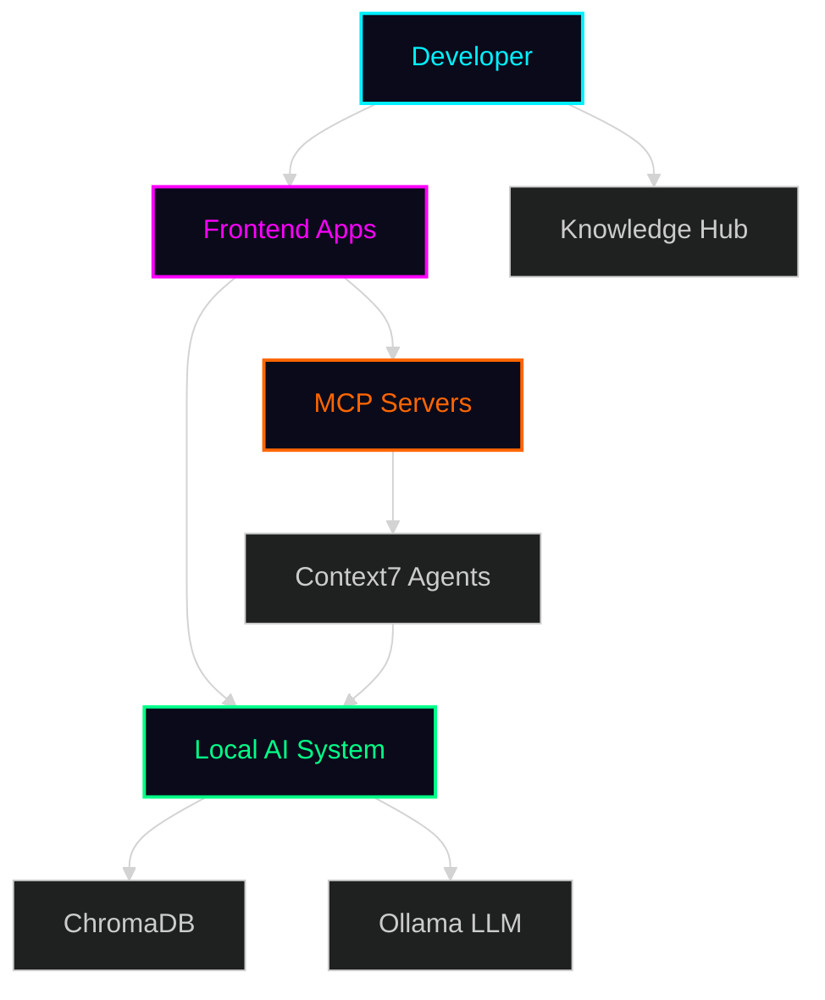

# 📚 DevTeam6 Documentation

Welcome to the DevTeam6 documentation hub! This directory contains comprehensive guides, architecture documentation, and integration resources.

---

## 🗂️ Documentation Structure

```
docs/
├── architecture/          # System architecture & design
│   ├── SYSTEM_OVERVIEW.md        # Complete system architecture
│   └── AI_ORCHESTRATION.md       # AI orchestration patterns
│
├── awesome-copilot/       # GitHub Awesome Copilot integration
│   └── INTEGRATION_GUIDE.md      # Integration guide & examples
│
├── DEPLOYMENT_GUIDE.md    # Deployment from local to production
├── QUICK_REFERENCE.md     # Fast access to commands & patterns
└── README.md              # This file
```

---

## 🎯 Quick Links

### Architecture Documentation
- **[System Overview](architecture/SYSTEM_OVERVIEW.md)** - Complete system architecture, components, data flow, and technology stack
- **[AI Orchestration](architecture/AI_ORCHESTRATION.md)** - Multi-tier AI architecture, RAG pipeline, and agent coordination

### Integration Guides
- **[Awesome Copilot Integration](awesome-copilot/INTEGRATION_GUIDE.md)** - How to integrate GitHub Awesome Copilot agents and prompts

### Operational Guides
- **[Deployment Guide](DEPLOYMENT_GUIDE.md)** - Local development to production deployment
- **[Quick Reference](QUICK_REFERENCE.md)** - Commands, endpoints, and common patterns

### Component Documentation
- **[Local AI System](../local-ai/README.md)** - Vector RAG foundation and MCP servers
- **[Workspace Guide](../WORKSPACE_GUIDE.md)** - Development workspace setup

---

## 📖 Documentation Overview

### System Architecture

The **System Overview** provides a comprehensive look at DevTeam6's architecture:
- 4-layer architecture (Knowledge, AI, Apps, Developer Experience)
- Core components and their responsibilities
- Data flow diagrams
- Technology stack details
- ~62,000 lines of code across 331 files

### AI Orchestration

The **AI Orchestration** document explains:
- Three-tier processing architecture (Cognitive, Processing, Storage)
- Query routing and intent classification
- RAG pipeline implementation
- Multi-agent coordination
- Performance optimization strategies

### Awesome Copilot Integration

The **Integration Guide** covers:
- GitHub Awesome Copilot ecosystem overview
- MCP server integration patterns
- Prompt library management
- Agent orchestration examples
- UI integration examples

---

## 🚀 Getting Started

### For New Contributors

1. **Start with System Overview**: Understand the overall architecture
2. **Review AI Orchestration**: Learn how the AI components work together
3. **Explore Integration Guide**: See how to extend the system with external resources
4. **Check Component Docs**: Deep dive into specific components

### For Users

1. **Read System Overview**: Understand what DevTeam6 offers
2. **Review Awesome Copilot Guide**: Learn about available agents and prompts
3. **Follow Integration Examples**: Set up your own integrations

---

## 📊 Key Metrics

| Component | Description | Lines of Code |
|-----------|-------------|---------------|
| **Frontend Apps** | Vue/React applications | ~15,000 |
| **Local AI System** | RAG pipeline + MCP servers | ~7,000 |
| **Templates** | Workspace starters | ~20,000 |
| **Knowledge Base** | README & resources | ~3,000 |
| **Context7 Agents** | Multi-agent system | ~3,000 |
| **Tests** | Test suites | ~5,000 |
| **Total** | **Entire codebase** | **~62,000** |

---

## 🎨 Architecture Diagrams

### High-Level System



See [System Overview](architecture/SYSTEM_OVERVIEW.md) for detailed diagrams.

---

## 🔗 External Resources

### Related Repositories
- [GitHub Awesome Copilot](https://github.com/topics/awesome-copilot)
- [Model Context Protocol](https://github.com/modelcontextprotocol)
- [Ollama](https://github.com/ollama/ollama)
- [ChromaDB](https://github.com/chroma-core/chroma)

### Community
- [DevTeam6 Repository](https://github.com/SpiralCloudOmega/DevTeam6)
- [GitHub Discussions](https://github.com/SpiralCloudOmega/DevTeam6/discussions)
- [Issues & Feature Requests](https://github.com/SpiralCloudOmega/DevTeam6/issues)

---

## 🤝 Contributing to Documentation

We welcome documentation improvements! To contribute:

1. **Fork the repository**
2. **Create a feature branch**: `git checkout -b docs/your-improvement`
3. **Make your changes**: Edit or add documentation files
4. **Follow style guide**: Use clear headings, Mermaid diagrams, and code examples
5. **Submit a PR**: Describe your documentation improvements

### Documentation Style Guide

- Use clear, concise language
- Include diagrams where helpful (Mermaid preferred)
- Provide code examples for technical concepts
- Link to related documentation
- Keep formatting consistent with existing docs

---

## 📝 Documentation TODO

- [ ] Add deployment guide
- [ ] Create troubleshooting guide
- [ ] Add performance tuning guide
- [ ] Create API reference
- [ ] Add more integration examples
- [ ] Create video tutorials
- [ ] Add architecture decision records (ADRs)

---

## 📞 Support

Need help? Here's how to get support:

- **Documentation Issues**: Open an issue on GitHub
- **Technical Questions**: Check GitHub Discussions
- **Feature Requests**: Submit via GitHub Issues
- **General Feedback**: Share in Discussions

---

*DevTeam6 Documentation - Built by developers, for developers*
