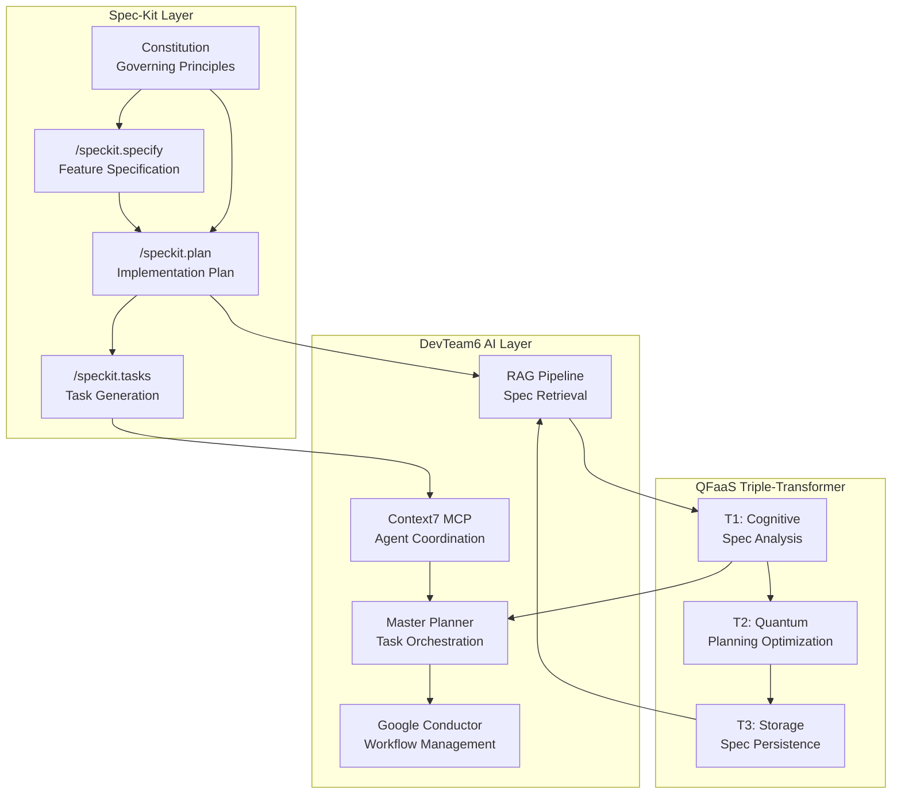

# 🌱 GitHub Spec-Kit Integration Guide

> Integrating Spec-Driven Development with DevTeam6's AI architecture

---

## 📖 Overview

GitHub Spec-Kit is a revolutionary toolkit for **Spec-Driven Development (SDD)** where specifications become executable and directly generate working implementations. This guide shows how to integrate Spec-Kit with DevTeam6's existing architecture including Context7 MCP, QFaaS Triple-Transformer systems, Master Planner, and Google Conductor.

**Official Repository**: [github/spec-kit](https://github.com/github/spec-kit)

---

## 🎯 What is Spec-Driven Development?

Spec-Driven Development **flips the script** on traditional development:

### Traditional Approach
```
Code → Specifications (throwaway documentation)
```

### Spec-Driven Approach
```
Specifications → Executable Code (living documentation)
```

**Key Insight**: Specifications become the primary artifact. Code is merely their expression in a particular language and framework.

---

## ⚡ Quick Start

### 1. Install Specify CLI

```bash
# Persistent installation (recommended)
uv tool install specify-cli --from git+https://github.com/github/spec-kit.git

# Verify installation
specify check

# One-time usage
uvx --from git+https://github.com/github/spec-kit.git specify init <PROJECT_NAME>
```

### 2. Initialize in DevTeam6

```bash
# Navigate to DevTeam6 directory
cd /path/to/DevTeam6

# Initialize Spec-Kit
specify init . --ai claude

# Or for GitHub Copilot
specify init . --ai copilot
```

### 3. Create Project Constitution

The constitution establishes governing principles for all development:

```bash
# Launch your AI assistant and use:
/speckit.constitution Create principles focused on:
- Code quality and testing standards  
- User experience consistency
- Performance requirements
- Security best practices
- Integration with Context7 MCP
- Alignment with QFaaS architecture
```

---

## 🔧 Three Core Commands

### 1. `/speckit.specify` - Feature Specification

Transforms feature descriptions into structured specifications.

**Workflow:**
1. Scans existing specs to determine next feature number
2. Creates semantic branch name from description
3. Generates `specs/[branch-name]/spec.md` from template
4. Populates with user stories and acceptance criteria

**Example:**
```bash
/speckit.specify Real-time collaborative code editor with syntax highlighting and multi-cursor support
```

**Output:**
- Creates branch: `003-collaborative-editor`
- Generates: `specs/003-collaborative-editor/spec.md`
- Template includes: user stories, acceptance criteria, non-functional requirements

### 2. `/speckit.plan` - Implementation Planning

Converts specifications into detailed implementation plans.

**Workflow:**
1. Reads feature specification
2. Ensures constitutional compliance
3. Converts requirements to technical architecture
4. Generates supporting documents (data models, API contracts, test scenarios)

**Example:**
```bash
/speckit.plan Use WebSocket for real-time sync, CodeMirror for editing, CRDT for conflict resolution
```

**Output:**
- `specs/003-collaborative-editor/plan.md` - Implementation architecture
- `specs/003-collaborative-editor/research.md` - Technology comparisons
- `specs/003-collaborative-editor/data-model.md` - Schemas and entities
- `specs/003-collaborative-editor/contracts/` - API definitions
- `specs/003-collaborative-editor/quickstart.md` - Validation scenarios

### 3. `/speckit.tasks` - Task Generation

Analyzes plans to generate executable task lists.

**Workflow:**
1. Reads `plan.md`, `data-model.md`, `contracts/`, `research.md`
2. Derives specific tasks from contracts and entities
3. Marks independent tasks with `[P]` for parallelization
4. Outlines safe parallel execution groups

**Example:**
```bash
/speckit.tasks
```

**Output:**
- `specs/003-collaborative-editor/tasks.md` - Executable task list with parallel markers

---

## 🏗️ Integration Architecture

### DevTeam6 + Spec-Kit System Diagram



### Integration Points

| Component | Integration Method | Purpose |
|-----------|-------------------|---------|
| **Context7 MCP** | Task sync via `sync_agent_state()` | Coordinate Spec-Kit tasks across agents |
| **Master Planner** | Import tasks from `tasks.md` | Orchestrate execution with dependencies |
| **Google Conductor** | Workflow templates from plans | Automate deployment pipelines |
| **RAG Pipeline** | Index specifications in ChromaDB | Enable semantic spec search |
| **QFaaS T1 (Cognitive)** | Analyze specs for ambiguities | Validate specification completeness |
| **QFaaS T2 (Quantum)** | Optimize task parallelization | Maximize development velocity |
| **QFaaS T3 (Storage)** | Store spec versions in NVMe | Track specification evolution |

---

## 📋 Workflow Example: Real-World Feature

### Scenario: Add AI-Powered Code Review to DevTeam6

#### Step 1: Specify (5 minutes)

```bash
/speckit.specify AI-powered code review system that analyzes PRs for bugs, security issues, and best practices violations. Integrates with GitHub webhooks and provides inline suggestions.
```

**Generated Files:**
- `specs/004-ai-code-review/spec.md`

**Key Sections:**
- User Stories: Developer submits PR → AI reviews code → Suggestions appear as comments
- Acceptance Criteria: 95% bug detection, <30s analysis time, inline suggestions
- Non-Functional: Performance, security, scalability requirements

#### Step 2: Plan (5 minutes)

```bash
/speckit.plan Use GitHub App for webhooks, Ollama with CodeLlama for analysis, FastAPI backend, Context7 MCP for agent coordination, ChromaDB for code pattern storage
```

**Generated Files:**
- `specs/004-ai-code-review/plan.md` - Architecture using DevTeam6's local-ai stack
- `specs/004-ai-code-review/research.md` - Comparison of CodeLlama vs alternatives
- `specs/004-ai-code-review/data-model.md` - ReviewResult, CodePattern, Suggestion schemas
- `specs/004-ai-code-review/contracts/webhook-events.json` - GitHub webhook payloads
- `specs/004-ai-code-review/contracts/api-endpoints.yaml` - FastAPI routes
- `specs/004-ai-code-review/quickstart.md` - Test with sample PR

#### Step 3: Generate Tasks (5 minutes)

```bash
/speckit.tasks
```

**Generated Tasks** (`specs/004-ai-code-review/tasks.md`):

```markdown
## Parallel Group 1 - Foundation
- [P] Task 1.1: Set up FastAPI backend in local-ai/
- [P] Task 1.2: Configure GitHub App credentials
- [P] Task 1.3: Create ReviewResult schema in data-model.md

## Parallel Group 2 - Core Features  
- [P] Task 2.1: Implement webhook receiver endpoint
- [P] Task 2.2: Integrate Ollama CodeLlama model
- [P] Task 2.3: Set up ChromaDB collection for code patterns

## Sequential Tasks - Integration
- Task 3.1: Connect webhook to analysis pipeline
- Task 3.2: Implement GitHub comment posting
- Task 3.3: Add Context7 MCP state sync
```

#### Step 4: Execute with Master Planner

```python
# In local-ai/agents/master_planner.py
from pathlib import Path

spec_dir = Path("specs/004-ai-code-review")
tasks = parse_spec_kit_tasks(spec_dir / "tasks.md")

# Coordinate with Context7 MCP
for parallel_group in tasks.parallel_groups:
    await context7_mcp.broadcast_message({
        "type": "parallel_task_group",
        "tasks": parallel_group,
        "allow_concurrent": True
    })

# Track progress
for task in tasks.sequential:
    await master_planner.execute_task(task)
    await context7_mcp.sync_agent_state(
        agent_id="spec-kit-executor",
        updates={"current_task": task.id, "status": "completed"}
    )
```

---

## 🎯 Core Principles

### 1. Specifications as Lingua Franca

The specification becomes the primary artifact. Code expresses it in a particular language/framework.

**Example:**
```yaml
# spec.md (stable)
requirement: "Users must be able to undo their last 10 actions"

# Implementation (changeable)
- React: useState + history stack
- Vue: Vuex + time-travel plugin
- Vanilla: Command pattern + stack
```

### 2. Executable Specifications

Specifications must be precise enough to generate working systems.

**Template Enforcement:**
```markdown
### User Story 1: Undo Action
**As a** user  
**I want to** undo my last action  
**So that** I can correct mistakes without restarting

**Acceptance Criteria:**
- [ ] Undo button appears after any action
- [ ] Clicking undo reverts the most recent change
- [ ] Up to 10 actions can be undone sequentially
- [ ] Undo is disabled when history is empty

[NEEDS CLARIFICATION: Should redo functionality also be included?]
```

### 3. Continuous Refinement

Validation happens continuously, not as a one-time gate.

**Integration:**
```python
# In local-ai/transformers/spec_validator.py
async def continuous_validation(spec_path: Path):
    """Use QFaaS T1 (Cognitive) to analyze specs"""
    spec_content = spec_path.read_text()
    
    # Detect ambiguities
    ambiguities = await cognitive_transformer.detect_ambiguities(spec_content)
    
    # Check contradictions
    contradictions = await cognitive_transformer.find_contradictions(spec_content)
    
    # Suggest improvements
    suggestions = await cognitive_transformer.improve_clarity(spec_content)
    
    return ValidationReport(ambiguities, contradictions, suggestions)
```

### 4. Research-Driven Context

Research agents gather critical context throughout the process.

**Spec-Kit + RAG Pipeline:**
```python
# In local-ai/core/rag_pipeline.py
async def research_for_plan(feature_description: str):
    """Gather context before planning"""
    
    # Search existing codebase
    similar_features = await rag.search_codebase(feature_description)
    
    # Search documentation
    relevant_docs = await rag.search_docs(feature_description)
    
    # Search external knowledge
    tech_options = await rag.search_external(feature_description)
    
    return ResearchContext(similar_features, relevant_docs, tech_options)
```

### 5. Bidirectional Feedback

Production reality informs specification evolution.

**Monitoring → Spec Updates:**
```python
# In local-ai/monitoring/spec_feedback.py
async def update_spec_from_metrics(feature_id: str):
    """Update specs based on production metrics"""
    
    metrics = await get_production_metrics(feature_id)
    
    if metrics.error_rate > 0.01:
        await add_spec_clarification(
            feature_id,
            section="Error Handling",
            clarification=f"Error rate {metrics.error_rate:.2%} exceeds 1% threshold. "
                         f"Add explicit error recovery for {metrics.top_errors}"
        )
    
    if metrics.p95_latency > 1000:
        await add_spec_requirement(
            feature_id,
            section="Performance",
            requirement=f"Optimize for <1s latency (currently {metrics.p95_latency}ms)"
        )
```

---

## 🔗 Integration Patterns

### Pattern 1: Spec → Context7 → Agents

Use Spec-Kit to define tasks, Context7 MCP to coordinate execution:

```python
# specs/feature-name/tasks.md
"""
## Parallel Group 1
- [P] Task 1: Implement API endpoint
- [P] Task 2: Create database schema
- [P] Task 3: Write unit tests
"""

# Execute with Context7
import yaml
from local_ai.core.context7_sync import Context7Sync

c7 = Context7Sync()

# Parse Spec-Kit tasks
with open("specs/feature-name/tasks.md") as f:
    tasks = parse_markdown_tasks(f.read())

# Broadcast parallel tasks
for task in tasks.parallel_group_1:
    await c7.broadcast_message({
        "type": "task_assignment",
        "task": task.description,
        "allow_parallel": True,
        "dependencies": []
    })
```

### Pattern 2: Constitution → QFaaS Optimization

Apply project constitution to optimize planning:

```python
# After /speckit.constitution
constitution_path = Path(".speckit/constitution.md")
constitution = constitution_path.read_text()

# Use QFaaS T2 (Quantum) for optimization
from local_ai.transformers.quantum_forge import optimize_with_constitution

optimized_plan = await optimize_with_constitution(
    raw_plan=initial_plan,
    constitution=constitution,
    constraints=[
        "minimize_token_usage",  # RAG planning
        "maximize_parallel_tasks",  # Velocity
        "ensure_test_coverage"  # Quality
    ]
)
```

### Pattern 3: Research → RAG → Planning

Feed Spec-Kit research into RAG pipeline:

```python
# In /speckit.plan command
async def enhanced_planning(spec: dict, context: str):
    # Get existing research
    research_file = Path(f"specs/{spec['id']}/research.md")
    
    if research_file.exists():
        research = research_file.read_text()
    else:
        # Generate using RAG
        from local_ai.core.rag_pipeline import RAGPipeline
        
        rag = RAGPipeline()
        research = await rag.research_feature(
            description=spec['description'],
            requirements=spec['acceptance_criteria'],
            context=context
        )
        
        research_file.write_text(research)
    
    # Generate plan with research context
    plan = await generate_plan(spec, research)
    return plan
```

### Pattern 4: Tasks → Master Planner → Execution

Import Spec-Kit tasks into Master Planner:

```python
# In local-ai/agents/master_planner.py
from pathlib import Path
import re

class SpecKitTaskImporter:
    def parse_tasks(self, tasks_md: str) -> list:
        """Parse Spec-Kit tasks.md format"""
        tasks = []
        current_group = None
        
        for line in tasks_md.split('\n'):
            if line.startswith('## '):
                current_group = line.replace('## ', '').strip()
            elif match := re.match(r'- \[([P ])\] Task ([\d.]+): (.+)', line):
                is_parallel = match.group(1) == 'P'
                task_id = match.group(2)
                description = match.group(3)
                
                tasks.append({
                    'id': task_id,
                    'description': description,
                    'parallel': is_parallel,
                    'group': current_group
                })
        
        return tasks
    
    async def import_to_planner(self, spec_dir: Path):
        """Import tasks into Master Planner"""
        tasks_file = spec_dir / "tasks.md"
        tasks = self.parse_tasks(tasks_file.read_text())
        
        # Create execution plan
        for task in tasks:
            await self.planner.add_task(
                id=task['id'],
                description=task['description'],
                allow_parallel=task['parallel'],
                group=task['group']
            )
        
        # Execute with Context7 coordination
        await self.planner.execute_with_mcp()
```

---

## 💡 Best Practices

### 1. Template-Driven Quality

Let templates constrain AI behavior:

```markdown
<!-- In .speckit/templates/feature-spec.md -->

### ✅ DO Focus On:
- WHAT users need
- WHY they need it
- WHEN/WHERE they'll use it

### ❌ DON'T Include:
- HOW to implement (no tech stack)
- Specific APIs or code structure
- Implementation details

### Uncertainty Handling:
- Use [NEEDS CLARIFICATION: question] for ambiguities
- Don't guess - mark unclear requirements
- Prefer asking over assuming
```

### 2. Progressive Elaboration

Start simple, add detail iteratively:

```bash
# Iteration 1: Basic spec
/speckit.specify User authentication system

# Iteration 2: Add OAuth details
# Edit spec.md to add:
# - OAuth 2.0 support
# - Social login (Google, GitHub)
# - MFA optional

# Iteration 3: Refine with research
/speckit.plan Research OAuth libraries for Python FastAPI
```

### 3. Constitution First

Establish principles before features:

```bash
# Before any feature specs
/speckit.constitution Create DevTeam6 development principles:

1. All APIs must use FastAPI with OpenAPI documentation
2. All data storage uses ChromaDB for vector search
3. All AI features use local Ollama models (privacy-first)
4. All agent coordination uses Context7 MCP
5. All planning uses RAG to minimize token usage
6. All features require >80% test coverage
7. All UIs follow cyberpunk design system
```

### 4. Parallel-First Thinking

Design for concurrent execution:

```markdown
## Task Breakdown Strategy

### Identify Independence:
- Data models (can be defined in parallel)
- API endpoints (independent routes)
- UI components (separate responsibilities)

### Sequential Only When Required:
- Database setup → Schema creation → Data migration
- Auth system → Protected endpoints → User features

### Example:
✅ Good:
- [P] Create User model
- [P] Create Post model  
- [P] Create Comment model
Then: - Create relationships

❌ Bad:
- Create User model
- Create Post model (depends on User)
- Create Comment model (depends on Post)
```

### 5. RAG-Enhanced Planning

Use RAG to inform all planning decisions:

```python
# Before /speckit.plan
async def rag_enhanced_planning(spec: dict):
    """Use RAG to gather context before planning"""
    
    # Search similar features
    similar = await rag.search(
        query=spec['description'],
        collection="devteam6_features",
        top_k=5
    )
    
    # Search documentation
    docs = await rag.search(
        query=spec['description'],
        collection="devteam6_docs",
        top_k=10
    )
    
    # Build context
    context = f"""
Similar Features in DevTeam6:
{format_results(similar)}

Relevant Documentation:
{format_results(docs)}

Project Constitution:
{load_constitution()}
"""
    
    # Generate plan with full context
    return await generate_plan(spec, context)
```

---

## 🔧 Configuration

### DevTeam6-Specific Setup

Create `.speckit/config.yaml`:

```yaml
project_name: "DevTeam6"
ai_assistant: "claude"  # or "copilot"

# Template customization
templates:
  feature_spec: ".speckit/templates/devteam6-feature.md"
  implementation_plan: ".speckit/templates/devteam6-plan.md"

# Integration settings
integrations:
  context7_mcp:
    enabled: true
    sync_endpoint: "http://localhost:8001/mcp/sync"
    
  rag_pipeline:
    enabled: true
    chroma_host: "localhost"
    chroma_port: 8000
    collections:
      - "devteam6_features"
      - "devteam6_docs"
      - "devteam6_code"
  
  master_planner:
    enabled: true
    import_tasks: true
    parallel_execution: true
  
  qfaas_transformers:
    cognitive: "http://localhost:8001/transform/cognitive"
    quantum: "http://localhost:8002/transform/quantum"
    storage: "http://localhost:8003/transform/storage"

# Validation rules
validation:
  require_acceptance_criteria: true
  require_test_scenarios: true
  max_clarifications: 5
  min_user_stories: 1

# Task generation
task_generation:
  mark_parallel: true
  group_by_phase: true
  include_dependencies: true
  integration_with_master_planner: true
```

---

## 📚 Resources

### Official Documentation
- [Spec-Kit GitHub](https://github.com/github/spec-kit)
- [Spec-Kit Documentation](https://github.github.io/spec-kit/)
- [Spec-Driven Development Philosophy](https://github.com/github/spec-kit/blob/main/spec-driven.md)
- [AGENTS.md](https://github.com/github/spec-kit/blob/main/AGENTS.md) - AI agent instructions

### DevTeam6 Resources
- [System Architecture](./architecture/SYSTEM_OVERVIEW.md)
- [AI Orchestration](./architecture/AI_ORCHESTRATION.md)
- [Context7 MCP Integration](../context7/agents.md)
- [QFaaS Triple-Transformer Systems](../DOCUMENTS.md)

### Related Tools
- [uv](https://github.com/astral-sh/uv) - Python package installer (required for Specify CLI)
- [GitHub Copilot](https://github.com/features/copilot) - AI pair programmer
- [Claude](https://claude.ai/) - Anthropic's AI assistant
- [Model Context Protocol](https://modelcontextprotocol.io/) - Agent communication standard

---

## 🎯 Next Steps

1. **Install Spec-Kit**: `uv tool install specify-cli --from git+https://github.com/github/spec-kit.git`
2. **Create Constitution**: `/speckit.constitution` with DevTeam6 principles
3. **Try a Feature**: `/speckit.specify` → `/speckit.plan` → `/speckit.tasks`
4. **Integrate with Context7**: Import tasks into Master Planner
5. **Enable RAG Planning**: Configure ChromaDB collections for spec search
6. **Optimize with QFaaS**: Use Triple-Transformer for plan optimization

---

## 💬 Support

- **Spec-Kit Issues**: [github.com/github/spec-kit/issues](https://github.com/github/spec-kit/issues)
- **DevTeam6 Discussions**: [Project Discussions](https://github.com/SpiralCloudOmega/DevTeam6/discussions)
- **Context7 MCP**: See `context7/agents.md` for agent coordination
- **Architecture Questions**: See `docs/architecture/` guides

---

*Spec-Kit Integration Guide - Part of DevTeam6's Comprehensive Documentation Suite*
