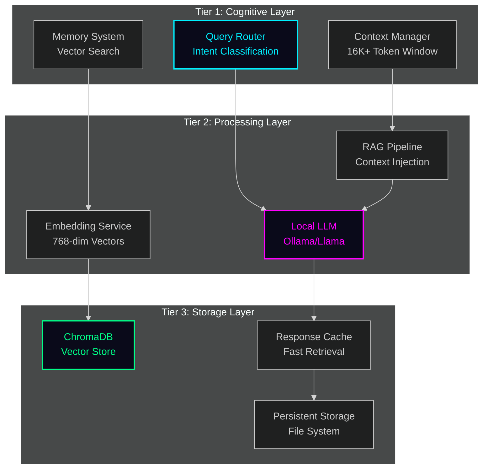

# AI Orchestration Architecture

## 🎯 Overview

DevTeam6 implements a multi-tier AI orchestration system inspired by modern QFaaS (Query-as-a-Service) and transformer architectures, adapted for local-first development.

---

## 🏗️ Three-Tier Architecture



---

## 🧠 Tier 1: Cognitive Layer

### Query Router

Classifies incoming queries and routes them to appropriate handlers:

```python
# local-ai/core/query_router.py
from enum import Enum
from typing import Dict, Any

class QueryType(Enum):
    CODE_GENERATION = "code"
    DOCUMENTATION = "docs"
    DEBUGGING = "debug"
    ARCHITECTURE = "arch"
    GENERAL = "general"

class QueryRouter:
    """Intelligent query routing with intent classification"""
    
    def __init__(self, llm_service):
        self.llm = llm_service
        self.routes = {
            QueryType.CODE_GENERATION: self._handle_code,
            QueryType.DOCUMENTATION: self._handle_docs,
            QueryType.DEBUGGING: self._handle_debug,
            QueryType.ARCHITECTURE: self._handle_arch,
            QueryType.GENERAL: self._handle_general
        }
    
    async def route(self, query: str) -> Dict[str, Any]:
        """Route query to appropriate handler"""
        # Classify intent
        query_type = await self._classify(query)
        
        # Get handler
        handler = self.routes[query_type]
        
        # Process
        return await handler(query)
    
    async def _classify(self, query: str) -> QueryType:
        """Classify query type using LLM"""
        prompt = f"""Classify this query into one of: code, docs, debug, arch, general
Query: {query}
Classification:"""
        
        response = await self.llm.generate(prompt, max_tokens=10)
        return self._parse_classification(response)
```

### Context Manager

Manages context windows up to 16K+ tokens with intelligent truncation:

```python
# local-ai/core/context_manager.py
from typing import List, Dict
from dataclasses import dataclass

@dataclass
class ContextWindow:
    max_tokens: int = 16384
    current_tokens: int = 0
    messages: List[Dict] = None
    
    def __post_init__(self):
        self.messages = []

class ContextManager:
    """Manages conversation context with smart truncation"""
    
    def __init__(self, max_tokens: int = 16384):
        self.window = ContextWindow(max_tokens=max_tokens)
    
    def add_message(self, role: str, content: str):
        """Add message to context window"""
        tokens = self._count_tokens(content)
        
        # Check if we need to truncate
        if self.window.current_tokens + tokens > self.window.max_tokens:
            self._truncate_oldest()
        
        self.window.messages.append({
            "role": role,
            "content": content,
            "tokens": tokens
        })
        self.window.current_tokens += tokens
    
    def get_context(self) -> List[Dict]:
        """Get current context for LLM"""
        return [
            {"role": msg["role"], "content": msg["content"]}
            for msg in self.window.messages
        ]
    
    def _truncate_oldest(self):
        """Remove oldest messages to make room"""
        while (self.window.current_tokens > self.window.max_tokens * 0.75 
               and len(self.window.messages) > 1):
            removed = self.window.messages.pop(0)
            self.window.current_tokens -= removed["tokens"]
```

---

## ⚙️ Tier 2: Processing Layer

### RAG Pipeline

Retrieval-Augmented Generation with semantic search:

```python
# local-ai/core/rag_pipeline.py
from typing import List, Optional
from .memory_system import MemorySystem
from .embedding_service import EmbeddingService

class RAGPipeline:
    """Retrieval-Augmented Generation pipeline"""
    
    def __init__(self):
        self.memory = MemorySystem()
        self.embedder = EmbeddingService()
    
    async def generate(
        self,
        query: str,
        context_sources: Optional[List[str]] = None,
        top_k: int = 5
    ) -> str:
        """Generate response using RAG"""
        
        # Step 1: Retrieve relevant context
        contexts = await self.memory.query(
            query=query,
            top_k=top_k,
            filter={"source": context_sources} if context_sources else None
        )
        
        # Step 2: Format context
        context_text = self._format_contexts(contexts)
        
        # Step 3: Build prompt with context
        prompt = self._build_prompt(query, context_text)
        
        # Step 4: Generate response
        from .ollama_service import OllamaService
        llm = OllamaService()
        response = await llm.generate(prompt)
        
        return response
    
    def _format_contexts(self, contexts: List[Dict]) -> str:
        """Format retrieved contexts for prompt"""
        formatted = []
        for ctx in contexts:
            formatted.append(f"[{ctx['source']}]\n{ctx['content']}")
        return "\n\n".join(formatted)
    
    def _build_prompt(self, query: str, context: str) -> str:
        """Build final prompt with query and context"""
        return f"""You are an expert developer assistant. Use the following context to answer the query.

Context:
{context}

Query: {query}

Answer:"""
```

### Multi-Model Orchestration

Support for multiple LLM backends:

```python
# local-ai/core/model_orchestrator.py
from abc import ABC, abstractmethod
from typing import Dict, Any

class LLMBackend(ABC):
    @abstractmethod
    async def generate(self, prompt: str, **kwargs) -> str:
        pass

class OllamaBackend(LLMBackend):
    async def generate(self, prompt: str, **kwargs) -> str:
        from services.ollama_service import OllamaService
        ollama = OllamaService()
        return await ollama.generate(prompt, **kwargs)

class OpenAIBackend(LLMBackend):
    async def generate(self, prompt: str, **kwargs) -> str:
        import openai
        response = await openai.ChatCompletion.acreate(
            model="gpt-4",
            messages=[{"role": "user", "content": prompt}],
            **kwargs
        )
        return response.choices[0].message.content

class ModelOrchestrator:
    """Orchestrate between multiple LLM backends"""
    
    def __init__(self):
        self.backends = {
            "ollama": OllamaBackend(),
            "openai": OpenAIBackend(),
        }
        self.default_backend = "ollama"
    
    async def generate(
        self,
        prompt: str,
        backend: str = None,
        **kwargs
    ) -> str:
        """Generate using specified or default backend"""
        backend_name = backend or self.default_backend
        
        if backend_name not in self.backends:
            raise ValueError(f"Unknown backend: {backend_name}")
        
        llm = self.backends[backend_name]
        return await llm.generate(prompt, **kwargs)
```

---

## 💾 Tier 3: Storage Layer

### Smart Caching

Response caching with semantic similarity:

```python
# local-ai/core/response_cache.py
from datetime import datetime, timedelta
import hashlib
from typing import Optional

class ResponseCache:
    """Cache responses with semantic similarity matching"""
    
    def __init__(self, ttl_minutes: int = 60):
        self.cache = {}
        self.ttl = timedelta(minutes=ttl_minutes)
        self.embedder = EmbeddingService()
    
    async def get(self, query: str) -> Optional[str]:
        """Get cached response if similar query exists"""
        query_embedding = await self.embedder.embed(query)
        
        # Find similar cached queries
        for cached_query, data in self.cache.items():
            # Check if expired
            if datetime.now() - data["timestamp"] > self.ttl:
                del self.cache[cached_query]
                continue
            
            # Check similarity
            similarity = self._cosine_similarity(
                query_embedding,
                data["embedding"]
            )
            
            if similarity > 0.95:  # Very similar
                return data["response"]
        
        return None
    
    async def set(self, query: str, response: str):
        """Cache response with embedding"""
        query_embedding = await self.embedder.embed(query)
        
        self.cache[query] = {
            "response": response,
            "embedding": query_embedding,
            "timestamp": datetime.now()
        }
```

---

## 🔄 Agent Orchestration

### Multi-Agent Coordination

```python
# local-ai/agents/coordinator.py
from typing import List, Dict
from enum import Enum

class AgentRole(Enum):
    RESEARCHER = "research"
    CODER = "code"
    REVIEWER = "review"
    DOCUMENTER = "docs"

class AgentCoordinator:
    """Coordinate multiple specialized agents"""
    
    def __init__(self):
        self.agents = {}
        self._initialize_agents()
    
    def _initialize_agents(self):
        """Initialize specialized agents"""
        self.agents = {
            AgentRole.RESEARCHER: ResearchAgent(),
            AgentRole.CODER: CodeAgent(),
            AgentRole.REVIEWER: ReviewAgent(),
            AgentRole.DOCUMENTER: DocAgent()
        }
    
    async def execute_workflow(
        self,
        task: str,
        workflow: List[AgentRole]
    ) -> Dict:
        """Execute multi-agent workflow"""
        results = {}
        context = {"initial_task": task}
        
        for role in workflow:
            agent = self.agents[role]
            
            # Execute agent with context from previous agents
            result = await agent.execute(task, context)
            
            # Store result
            results[role.value] = result
            
            # Update context for next agent
            context[role.value] = result
        
        return results

# Example usage:
# coordinator = AgentCoordinator()
# results = await coordinator.execute_workflow(
#     task="Build a REST API for user management",
#     workflow=[
#         AgentRole.RESEARCHER,  # Research best practices
#         AgentRole.CODER,       # Write the code
#         AgentRole.REVIEWER,    # Review for issues
#         AgentRole.DOCUMENTER   # Generate docs
#     ]
# )
```

---

## 📊 Performance Optimization

### Batch Processing

```python
# local-ai/core/batch_processor.py
import asyncio
from typing import List

class BatchProcessor:
    """Process queries in batches for efficiency"""
    
    def __init__(self, batch_size: int = 10):
        self.batch_size = batch_size
        self.queue = []
    
    async def add(self, query: str) -> str:
        """Add query to batch"""
        future = asyncio.Future()
        self.queue.append((query, future))
        
        # Process batch when full
        if len(self.queue) >= self.batch_size:
            await self._process_batch()
        
        return await future
    
    async def _process_batch(self):
        """Process current batch"""
        if not self.queue:
            return
        
        batch = self.queue[:self.batch_size]
        self.queue = self.queue[self.batch_size:]
        
        # Generate embeddings in batch
        queries = [q for q, _ in batch]
        embeddings = await self._batch_embed(queries)
        
        # Resolve futures
        for (query, future), embedding in zip(batch, embeddings):
            future.set_result(embedding)
```

### Streaming Responses

```python
# local-ai/core/streaming.py
from typing import AsyncGenerator

class StreamingGenerator:
    """Stream LLM responses token by token"""
    
    async def generate_stream(
        self,
        prompt: str
    ) -> AsyncGenerator[str, None]:
        """Generate response with streaming"""
        from services.ollama_service import OllamaService
        
        ollama = OllamaService()
        
        async for token in ollama.generate_stream(prompt):
            yield token
```

---

## 🎯 Integration Points

### Frontend Integration

```typescript
// app/src/services/aiOrchestrator.ts
export class AIOrchestrator {
  private baseUrl = 'http://localhost:8000';
  
  async query(
    query: string,
    options: {
      backend?: 'ollama' | 'openai';
      useCache?: boolean;
      stream?: boolean;
    } = {}
  ): Promise<string | AsyncIterable<string>> {
    const endpoint = options.stream ? '/stream' : '/query';
    
    const response = await fetch(`${this.baseUrl}${endpoint}`, {
      method: 'POST',
      headers: { 'Content-Type': 'application/json' },
      body: JSON.stringify({
        query,
        backend: options.backend || 'ollama',
        use_cache: options.useCache ?? true
      })
    });
    
    if (options.stream) {
      return this.handleStream(response);
    }
    
    const data = await response.json();
    return data.response;
  }
  
  private async *handleStream(response: Response) {
    const reader = response.body!.getReader();
    const decoder = new TextDecoder();
    
    while (true) {
      const { done, value } = await reader.read();
      if (done) break;
      
      const text = decoder.decode(value);
      yield text;
    }
  }
}
```

---

## 📈 Monitoring

```python
# local-ai/core/monitoring.py
from datetime import datetime
from collections import defaultdict

class OrchestrationMetrics:
    """Track orchestration performance"""
    
    def __init__(self):
        self.metrics = defaultdict(list)
    
    def record_query(
        self,
        query_type: str,
        duration: float,
        backend: str,
        cache_hit: bool
    ):
        """Record query metrics"""
        self.metrics["queries"].append({
            "type": query_type,
            "duration": duration,
            "backend": backend,
            "cache_hit": cache_hit,
            "timestamp": datetime.now()
        })
    
    def get_stats(self) -> dict:
        """Get orchestration statistics"""
        queries = self.metrics["queries"]
        
        return {
            "total_queries": len(queries),
            "avg_duration": sum(q["duration"] for q in queries) / len(queries),
            "cache_hit_rate": sum(1 for q in queries if q["cache_hit"]) / len(queries),
            "backend_usage": self._count_by_field(queries, "backend")
        }
```

---

## 🚀 Future Enhancements

- [ ] Multi-modal inputs (text + images)
- [ ] Distributed processing across nodes
- [ ] GPU acceleration for embeddings
- [ ] Fine-tuned models for specific domains
- [ ] Federated learning capabilities
- [ ] Real-time model switching
- [ ] Advanced caching strategies
- [ ] Quantum-inspired optimization (research phase)

---

*AI Orchestration Architecture for DevTeam6 - Local-first, privacy-preserving, scalable*
