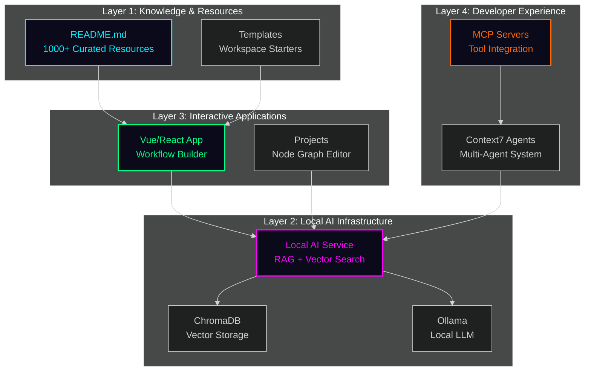
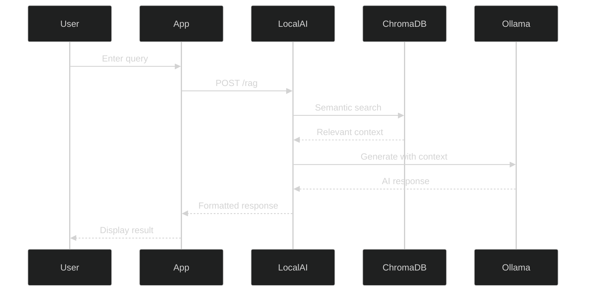
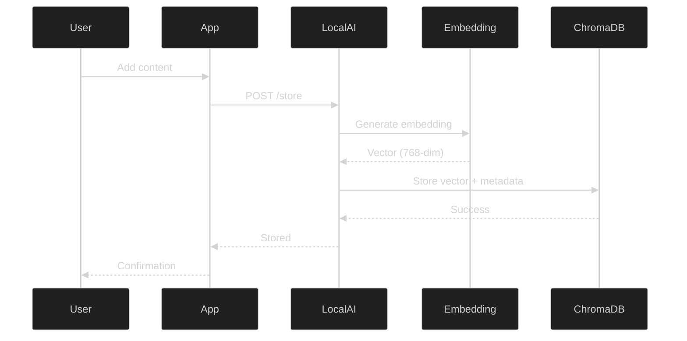

# DevTeam6 System Architecture Overview

## 🎯 Vision

DevTeam6 is a comprehensive AI-powered development platform that combines:
- **Knowledge Hub**: Curated repository of 1000+ developer resources
- **Local AI System**: Self-hosted RAG pipeline with vector search
- **Interactive Tools**: Web-based workflow builders and visualizations
- **Template Library**: Production-ready development environments

---

## 🏗️ Architecture Layers



---

## 📦 Core Components

### 1. Knowledge Repository (README.md)
- **Purpose**: Curated encyclopedia of developer tools and resources
- **Content**: 1000+ links to AI platforms, frameworks, tools
- **Features**: Interactive diagrams, quick navigation, learning paths
- **Lines of Code**: ~3,000 lines of structured markdown

### 2. Local AI System (`/local-ai`)
- **Purpose**: Self-hosted AI backend with RAG capabilities
- **Technology Stack**:
  - FastAPI for async REST API
  - ChromaDB for vector storage
  - Ollama for local LLM inference
  - Pydantic for data validation
- **Features**:
  - Embedding generation
  - Semantic search
  - Retrieval-augmented generation
  - Context7 agent synchronization
- **API Endpoints**:
  - `/embed` - Generate text embeddings
  - `/store` - Store content in vector DB
  - `/query` - Semantic search
  - `/rag` - RAG-powered responses
- **Lines of Code**: ~5,000 lines of Python

### 3. Interactive Applications (`/app` & `/projects`)
- **Purpose**: Web-based tools for development workflows
- **Technology Stack**:
  - Vue 3 / React for UI
  - TypeScript for type safety
  - Vite for build tooling
  - Three.js for 3D visualizations
- **Applications**:
  - **Dashboard**: Central hub for navigation
  - **Node Graph Editor**: n8n-style workflow builder
  - **Semantic Knowledge Hub**: AI-first knowledge graph
  - **GenUI Playground**: AI-powered component generator
  - **Repomind Workstation**: Repository intelligence
  - **Video Storytelling**: Chapter-based tutorials
  - **Control Deck**: Mission control interface
- **Lines of Code**: ~15,000 lines of TypeScript/TSX

### 4. Template Library (`/templates`)
- **Purpose**: Production-ready development environments
- **Templates**:
  - React Starter (React 18 + TypeScript + Vite)
  - Vue 3 Starter (Vue 3 + Composition API)
  - .NET 8 API (ASP.NET Core REST)
  - C++ Workspace (C++20 + CMake + OpenGL)
  - C Workspace (C17 + Make + SDL2)
  - Audio/DSP (JUCE + VST3)
  - Graphics Engine (Vulkan 1.3 + GLFW)
- **Features**: Dev containers, VS Code integration, build systems
- **Lines of Code**: ~20,000 lines across all templates

### 5. MCP Servers (`/local-ai/mcp`)
- **Purpose**: Model Context Protocol integration for AI agents
- **Servers**:
  - Memory Server: Persistent agent memory
  - RAG Server: Retrieval-augmented generation
  - Tool Schemas: Standardized tool definitions
- **Lines of Code**: ~2,000 lines of Python

### 6. Context7 Agents (`/context7`)
- **Purpose**: Multi-agent orchestration system
- **Capabilities**:
  - Agent coordination
  - Task distribution
  - State synchronization
- **Lines of Code**: ~3,000 lines

---

## 🔄 Data Flow

### User Query → AI Response



### Content Storage Flow



---

## 🚀 Deployment Architecture

### Local Development

```
┌─────────────────────────────────────────┐
│  Developer Machine (localhost)          │
│                                         │
│  ┌──────────┐  ┌──────────┐           │
│  │ Ollama   │  │ ChromaDB │           │
│  │ :11434   │  │ :8000    │           │
│  └──────────┘  └──────────┘           │
│        ↑            ↑                  │
│        └────────────┘                  │
│               │                        │
│        ┌──────────────┐                │
│        │  Local AI    │                │
│        │  FastAPI     │                │
│        │  :8000       │                │
│        └──────────────┘                │
│               ↑                        │
│        ┌──────────────┐                │
│        │  Vue/React   │                │
│        │  Vite Dev    │                │
│        │  :5173       │                │
│        └──────────────┘                │
│               ↑                        │
│           Browser                      │
│                                         │
└─────────────────────────────────────────┘
```

### Production (GitHub Pages)

```
┌─────────────────────────────────────────┐
│  GitHub Pages                           │
│  ┌──────────────────────────────────┐  │
│  │  Static Assets (app/dist)        │  │
│  │  - index.html                    │  │
│  │  - JS bundles                    │  │
│  │  - CSS                           │  │
│  └──────────────────────────────────┘  │
│               ↑                        │
│           CDN Edge                     │
└─────────────────────────────────────────┘
```

---

## 📊 Technology Stack

| Layer | Technologies |
|-------|-------------|
| **Frontend** | Vue 3, React 18, TypeScript, Vite, Three.js |
| **Backend** | FastAPI, Python 3.10+, Uvicorn |
| **Database** | ChromaDB (vector), File system (persistence) |
| **AI/ML** | Ollama, LangChain, Sentence Transformers |
| **DevOps** | GitHub Actions, Docker, Node.js |
| **Protocols** | MCP (Model Context Protocol), REST API |

---

## 🎨 Design Principles

### 1. Local-First
- No cloud dependencies for core features
- Privacy-preserving AI with Ollama
- All data stored locally

### 2. Modular Architecture
- Each component can function independently
- Clear interfaces between layers
- Easy to extend or replace components

### 3. Developer Experience
- Fast build times with Vite
- Hot module replacement
- TypeScript for type safety
- Comprehensive testing

### 4. AI-Ready
- MCP server integration
- Context7 agent framework
- Vector search for semantic queries
- RAG for context-aware responses

---

## 📈 Metrics

| Metric | Value |
|--------|-------|
| Total Lines of Code | ~62,000 |
| Total Files | ~331 |
| Programming Languages | 8+ (Python, TypeScript, JavaScript, C++, C#, etc.) |
| API Endpoints | 10+ |
| Interactive Pages | 12+ |
| Templates | 7 |
| MCP Servers | 3 |
| Test Coverage | Growing |

---

## 🔮 Future Enhancements

### Planned Features
- [ ] Multi-modal embeddings (text + images)
- [ ] Distributed vector search
- [ ] Real-time collaboration features
- [ ] Mobile companion app
- [ ] VS Code extension integration
- [ ] Cloud deployment guides
- [ ] Enhanced agent orchestration

### Community Contributions
- See [CONTRIBUTING.md](../../README.md#contributing) for guidelines
- Check [GitHub Issues](https://github.com/SpiralCloudOmega/DevTeam6/issues)
- Join discussions and propose features

---

*Part of the DevTeam6 Omega Tool Kit - Built in record time with AI assistance*
